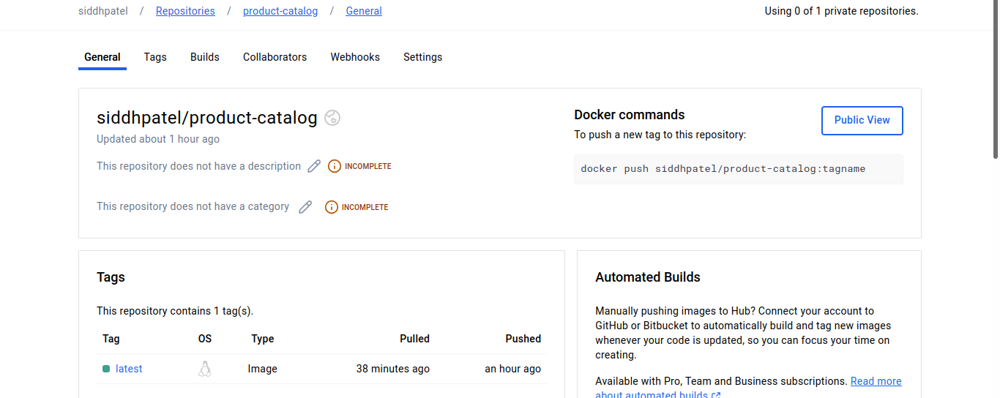

# Assessment: Use Case Oriented Project

#### You are tasked with setting up a CI/CD pipeline for a microservices-based application. The application will be containerized using Docker and orchestrated using Kubernetes. Ansible will be used for configuration management and deployment. The entire setup should be managed using Git for version control, and Jenkins will be used to automate the CI/CD process.

### Task 1: Git Repository Setup


### Task 2: Dockerize Microservices
##### - Front-end microservice
 1) Dockerfile:
 ```
 # Use the official Nginx image
FROM nginx:latest

# Copy static HTML files to Nginx's default directory
COPY index.html /usr/share/nginx/html/

# Expose port 80
EXPOSE 80
 ```
 2) index.html:
 ```
 <!DOCTYPE html>
<html lang="en">
<head>
    <meta charset="UTF-8">
    <meta name="viewport" content="width=device-width, initial-scale=1.0">
    <title>Front-End Service</title>
</head>
<body>
    <h1>Welcome to the Front-End Service</h1>
</body>
</html>
 ```
 
 ##### -Product Catalog microservice
 1) Dockerfile:
 ```
 # Use the official Nginx image
FROM nginx:latest

# Copy static HTML files to Nginx's default directory
COPY index.html /usr/share/nginx/html/

# Expose port 80
EXPOSE 80

 ```
 2) index.html:
 ```
 <!DOCTYPE html>
<html lang="en">
<head>
    <meta charset="UTF-8">
    <meta name="viewport" content="width=device-width, initial-scale=1.0">
    <title>Product Catalog Service Service</title>
</head>
<body>
    <h1>Welcome to the Product Catalog Service</h1>
</body>
</html>

 ```
 
 ##### - Order Processing microservice
 1) Dockerfile:
 ```
 # Use the official Nginx image
FROM nginx:latest

# Copy static HTML files to Nginx's default directory
COPY index.html /usr/share/nginx/html/

# Expose port 80
EXPOSE 80
 ```
 2) index.html:
 ```
 <!DOCTYPE html>
<html lang="en">
<head>
    <meta charset="UTF-8">
    <meta name="viewport" content="width=device-width, initial-scale=1.0">
    <title>Order Processing Service</title>
</head>
<body>
    <h1>Welcome to the Order Processing Service</h1>
</body>
</html>
 ```


## Output:


### Docker hub Repo




### Task 3: Kubernetes Deployment

- Start the minikube


- 1) ingress-resource.yaml
```
apiVersion: networking.k8s.io/v1
kind: Ingress
metadata:
  name: web-app-ingress
  namespace: default
  annotations:
    nginx.ingress.kubernetes.io/rewrite-target: /
spec:
  rules:
  - host: myapp.local
    http:
      paths:
      - path: /frontend
        pathType: Prefix
        backend:
          service:
            name: front-end-service
            port:
              number: 80
      - path: /product
        pathType: Prefix
        backend:
          service:
            name: product-catalog-service
            port:
              number: 80
      - path: /order
        pathType: Prefix
        backend:
          service:
            name: order-processing-service
            port:
              number: 80
      
```
- 2) front-end-deployment.yaml
```
apiVersion: apps/v1
kind: Deployment
metadata:
  name: front-end
spec:
  replicas: 3
  selector:
    matchLabels:
      app: front-end
  template:
    metadata:
      labels:
        app: front-end
    spec:
      containers:
      - name: front-end
        image: siddhpatel/front-end:latest
        ports:
        - containerPort: 80

---
apiVersion: v1
kind: Service
metadata:
  name: front-end-service
spec:
  selector:
    app: front-end
  ports:
  - protocol: TCP
    port: 80
    targetPort: 80
  type: ClusterIP
```

- 3) product-catalog.yaml
```
apiVersion: apps/v1
kind: Deployment
metadata:
  name: product-catalog
spec:
  replicas: 3
  selector:
    matchLabels:
      app: product-catalog
  template:
    metadata:
      labels:
        app: product-catalog
    spec:
      containers:
      - name: product-catalog
        image: siddhpatel/product-catalog:latest
        ports:
        - containerPort: 80
---
apiVersion: v1
kind: Service
metadata:
  name: product-catalog-service
spec:
  selector:
    app: product-catalog
  ports:
  - protocol: TCP
    port: 80
    targetPort: 80
  type: ClusterIP

```

- 4) order-processing.yaml
```
apiVersion: apps/v1
kind: Deployment
metadata:
  name: order-processing
spec:
  replicas: 3
  selector:
    matchLabels:
      app: order-processing
  template:
    metadata:
      labels:
        app: order-processing
    spec:
      containers:
      - name: order-processing
        image: siddhpatel/order-processing:latest
        ports:
        - containerPort: 80
---
apiVersion: v1
kind: Service
metadata:
  name: order-processing-service
spec:
  selector:
    app: order-processing
  ports:
  - protocol: TCP
    port: 80
    targetPort: 80
  type: ClusterIP

```


## Output


