### **Comprehensive Linux Operations**
### **Project Breakdown**
#### **Part 1: Creating and Editing Text Files (20 minutes)**
**script to create and edit file using 3 different editor.**

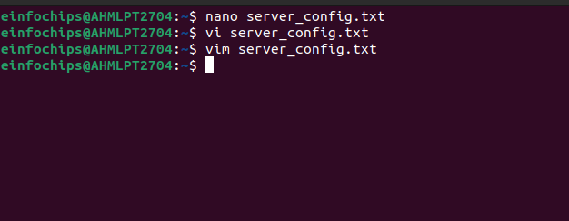
#### 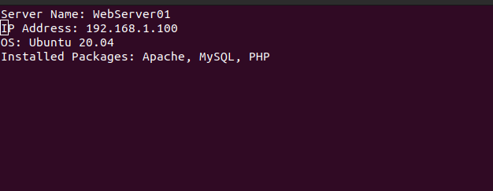
#### **Content written inside file.**
#### **Part 2: User & Group Management (20 minutes)**
**Scenario:** You need to set up user accounts and groups for a new team joining the project.

1. **Adding/Removing Users**

**Add a new user developer:**

sudo adduser developer

**Remove the user developer:**

sudo deluser developer

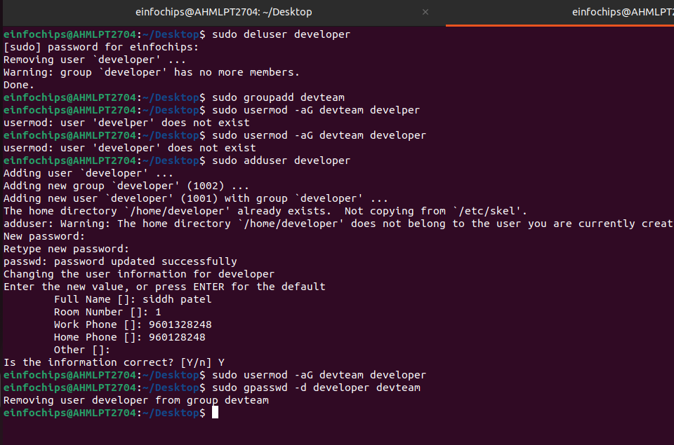

**This command will create a user named “developer” and also delete the same.**

1. **Managing Groups**

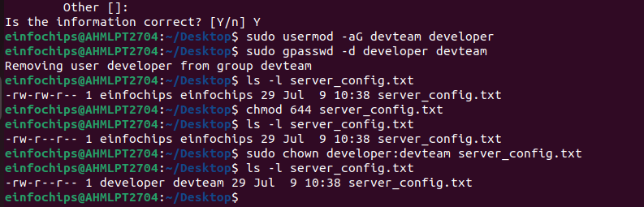
#### **It will create devteam group and add user named developer.**
#### **Part 3: File Permissions Management (20 minutes)**
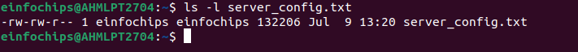
#### **It will give decription of file having different permissions to be handled.**
#### **Part 4: Controlling Services and Daemons (20 minutes)**
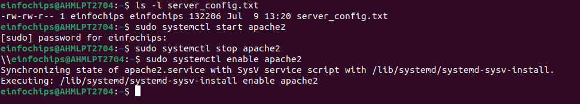
#### **Part 5: Process Handling (20 minutes)**
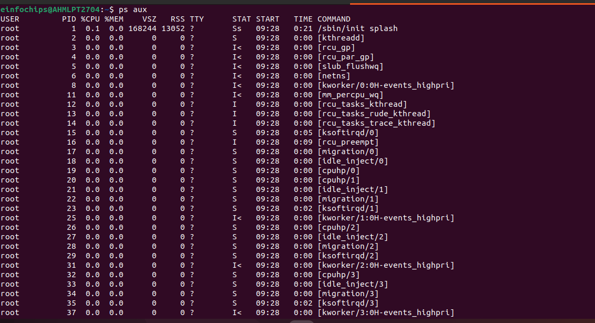
### 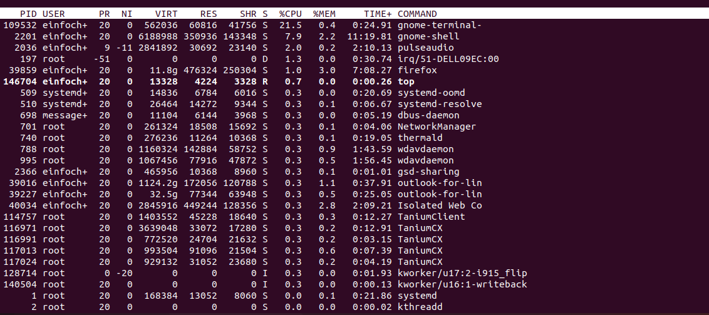
### **Creating and Deploying a Static Website with Apache2**
#### 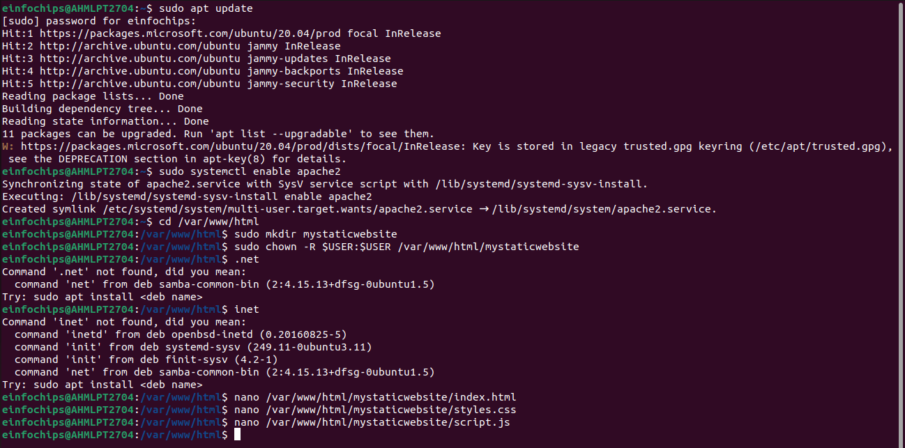
#### **It will install apache2 version.**
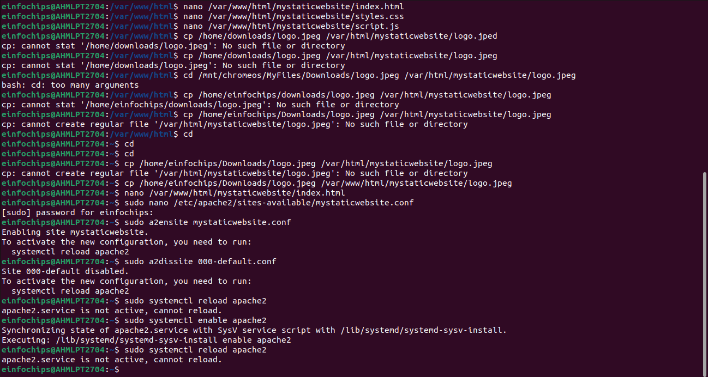
#### **Now, 3 files are created for building a static website.**
####
#### **Part 3: Configuring Apache2 to Serve the Website (10 minutes)**
1. **Create a Virtual Host File**

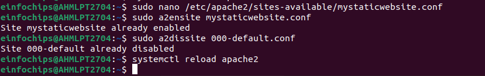We need to change the by default config file by adding default address of our path. And after wards we need to reload browser.

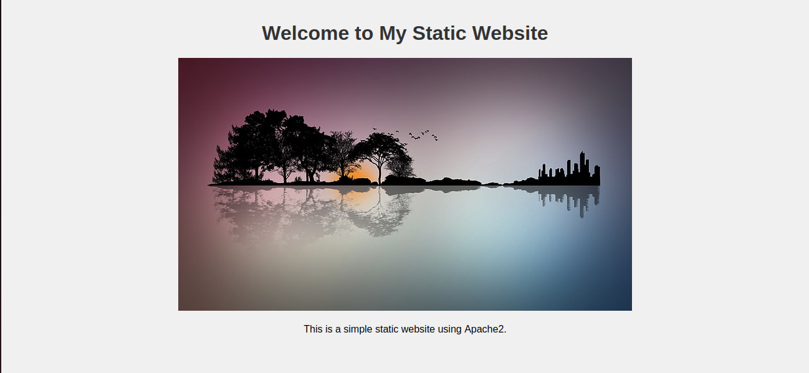The index.html will run like below output.
