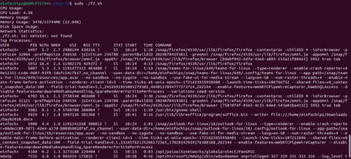
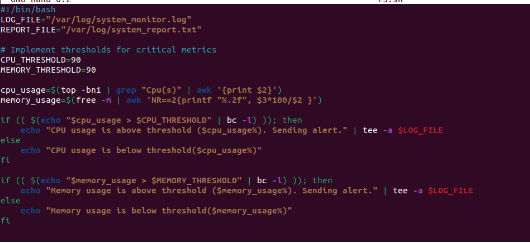
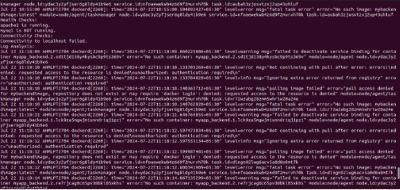
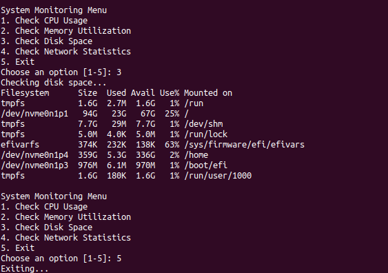

**Time: 1 Hour**

**Project Overview:** Develop a comprehensive shell script for sysops to automate system monitoring and generate detailed reports. The script will leverage advanced Linux shell scripting techniques to monitor system metrics, capture logs, and provide actionable insights for system administrators.

**Deliverables:**

1. **Script Initialization:**
   1. Initialize script with necessary variables and configurations.
   1. Validate required commands and utilities availability.

      **F1.sh:**

      

1. **System Metrics Collection:**
   1. Monitor CPU usage, memory utilization, disk space, and network statistics.
   1. Capture process information including top processes consuming resources.

**F2.sh**

1. **Log Analysis:**
   1. Parse system logs (e.g., syslog) for critical events and errors.
   1. Generate summaries of recent log entries based on severity.

**F3.sh**

1. **Health Checks:**
   1. Check the status of essential services (e.g., Apache, MySQL).
   1. Verify connectivity to external services or databases.

**F4.sh**

1. **Alerting Mechanism:**
   1. Implement thresholds for critical metrics (CPU, memory) triggering alerts.
   1. Send email notifications to sysadmins with critical alerts.

      **F5.sh**

      

1. **Report Generation:**
   1. Compile all collected data into a detailed report.
   1. Include graphs or visual representations where applicable.

      **F6.sh:**

      

1. **Automation and Scheduling:**
   1. Configure the script to run periodically via cron for automated monitoring.
   1. Ensure the script can handle both interactive and non-interactive execution modes.

      **F7.sh:**

      

1. **User Interaction:**
   1. Provide options for interactive mode to allow sysadmins to manually trigger checks or view specific metrics.
   1. Ensure the script is user-friendly with clear prompts and outputs.

F8.sh

