Jenkins Sample Demo

To start Jenkins:

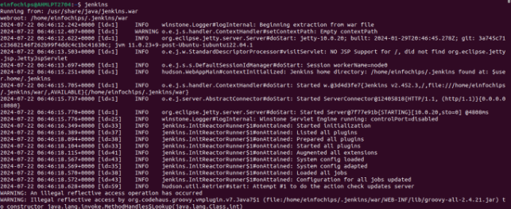After Starting Jenkins:

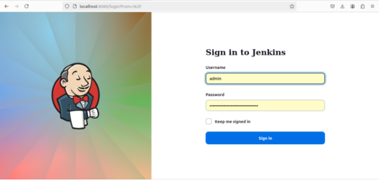

This will be the home page.

Create a sample jenkins project to test java app which is stored inside a git repository.

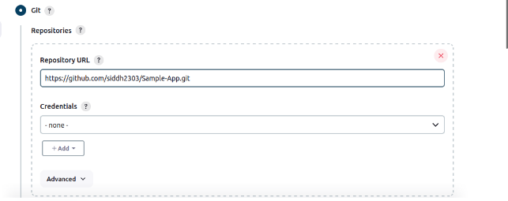Output of this build:

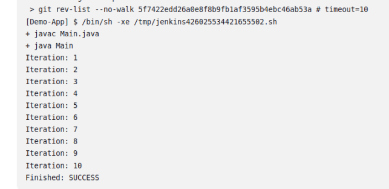Create A Maven based Compile and Test build application in Jenkins for testing in a pipeline.

**Dev Compile:**

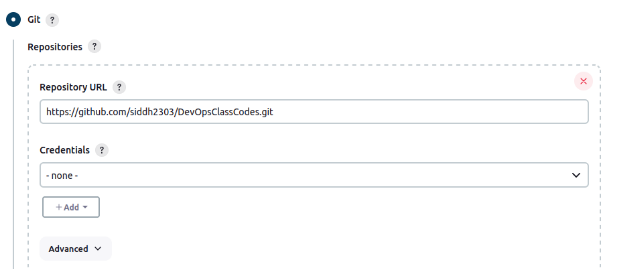This will fetch the code from git repository.

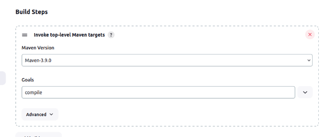It states version of Maven used for build. We need to set goals as compile as it will just compile the application.

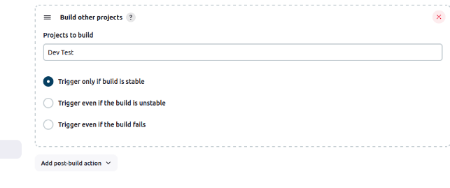This step needs to be done, if there is Dev Test build available. It means that whenever Dev Compile build will successfully take place, Dev Test build will be called automatically.

**Dev Test:**

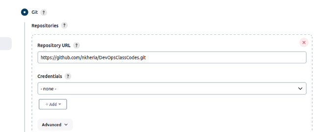Fetch the code from git repository.

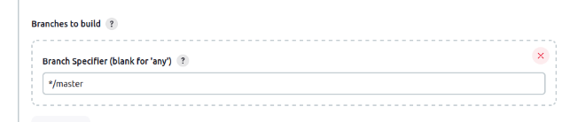Type same branch which is available inside git repository.

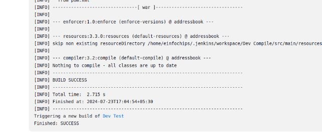

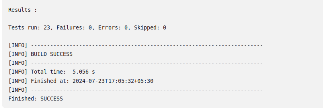

Creating a build using private repository in Git.

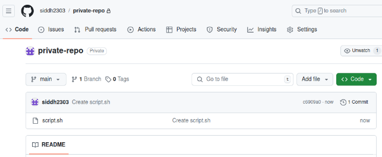Inside this repository, there is one shell script file which will be executed inside build in Jenkins.

**To create a build:**

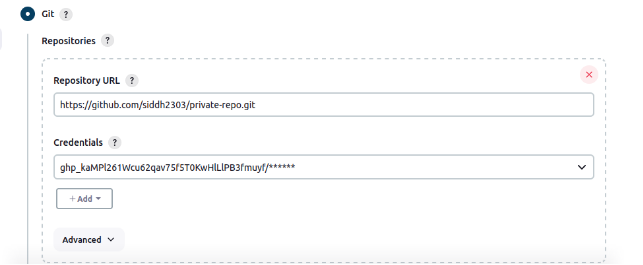Here, along with git repository url, credentials are also passed so that the files inside it are accessed.

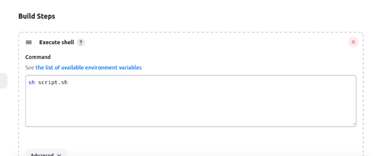This command will run the script file whenever it is build.

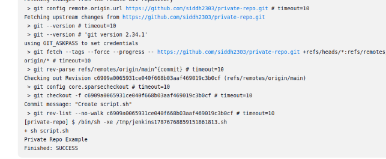**Create a pipeline view:**

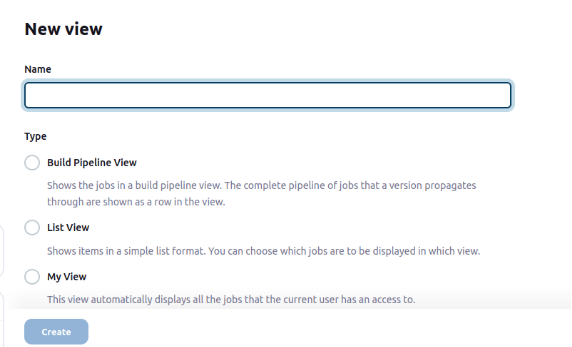This will create pipeline view which overviews about the build occuring in a sequence.

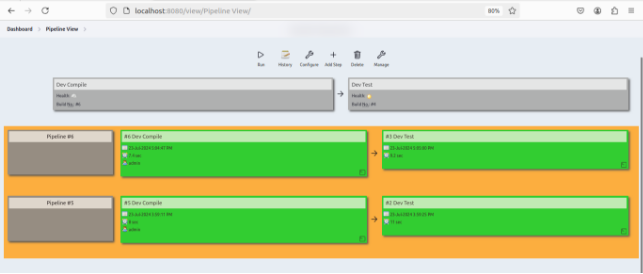
