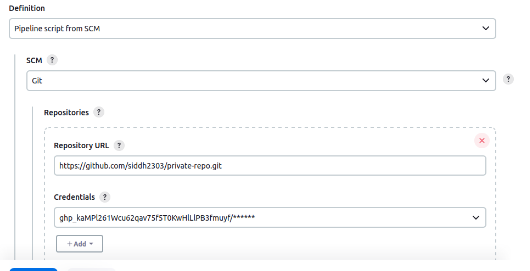
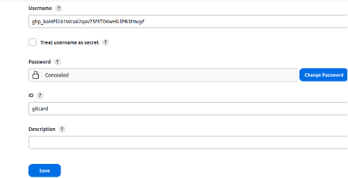
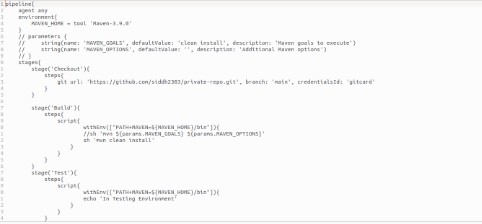
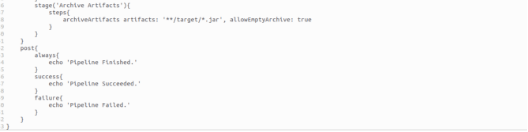
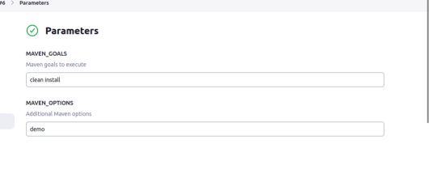
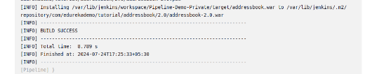
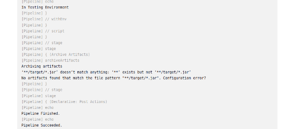
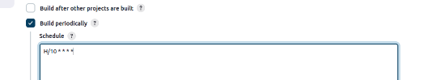

### **Project 01**
#### **Project Overview**
Your organization is implementing continuous integration (CI) practices to streamline the software development lifecycle. As part of this initiative, you will create a Jenkins declarative pipeline for building a simple Maven project hosted on GitHub. This project aims to automate the build process, ensure code quality, and facilitate continuous delivery (CD).
#### **Objectives**
- Create a Jenkins pipeline script using declarative syntax.
- Clone a Maven project from a specified GitHub repository.
- Execute the build process and run unit tests.
- Archive build artifacts.
- Provide clear feedback on build status through Jenkins' UI and console output.
#### **Instructions**
1. **Setup Jenkins Job**
   1. Create a new Jenkins pipeline job.

      

   1. Configure the job to pull the Jenkinsfile from the GitHub repository.

1. **Create Jenkinsfile**
   1. Write a declarative pipeline script (Jenkinsfile) that includes the following stages:
      1. **Clone Repository**: Clone the Maven project from the GitHub repository.
      1. **Build**: Execute the Maven build process (mvn clean install).
      1. **Test**: Run unit tests as part of the Maven build.
      1. **Archive Artifacts**: Archive the build artifacts for future use.

Jenkins File:

1. **Configure Pipeline Parameters**
   1. Allow the pipeline to accept parameters such as Maven goals and options for flexibility.
   1. Ensure the pipeline can be easily modified for different build configurations.

1. **Run the Pipeline**
   1. Trigger the Jenkins pipeline job manually or set up a webhook for automatic triggering on GitHub repository changes.
   1. Monitor the build process through Jenkins' UI and console output.

      

