### **Multi-Branch Project**
#### **Project Overview**
- Create a simple Java Maven project.
- Version-control the project using Git with multiple branches.
- Set up Jenkins multi-branch pipeline for automated build and deployment.
- Utilize Jenkins environment variables in the Jenkinsfile.
#### **Project Objectives**
- Version-control using Git.
- Jenkins multi-branch pipeline setup.
- Environment variable management using Jenkinsfile.
#### **Project Deliverables**
1. **Git Repository:**
   1. Local Git repository initialized.
   1. Branches: development, staging, and production.
   1. Repository pushed to remote Git server (e.g., GitHub, GitLab, Bitbucket).

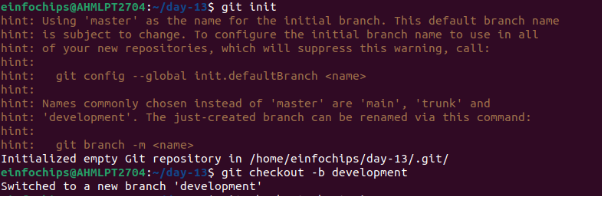

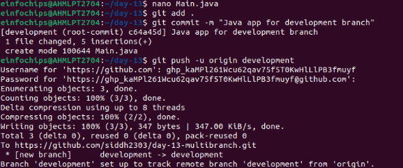

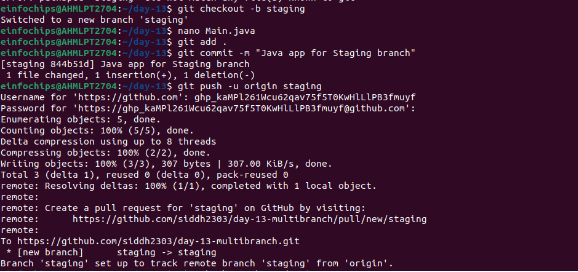

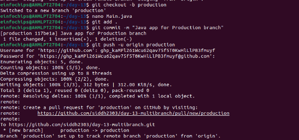

**Main.java:**

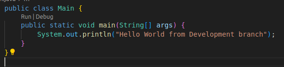

1. **Jenkins Setup:**
   1. Multi-branch pipeline job configured in Jenkins.
   1. Jenkinsfile defining build and deployment steps.
   1. Environment variables managed using Jenkins environment variable settings.

**Jenkinsfile:**

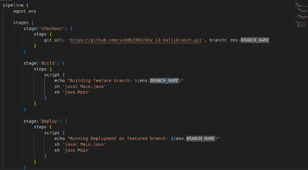**To create environment variable inside Jenkins:**

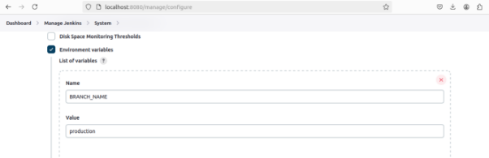**Create a Jenkins project having type Multibranch Pipeline**

**Add git repository:**

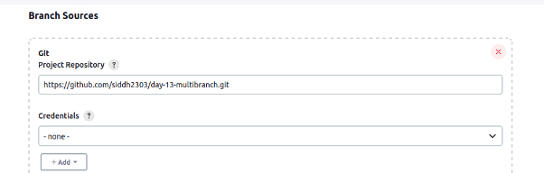**Build-1 Development branch:**

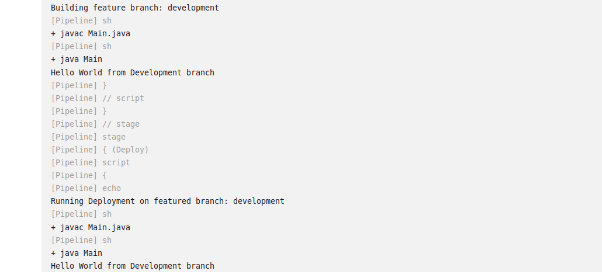**Build-2 Staging:**

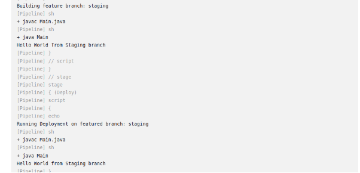**Build-3 Production:**

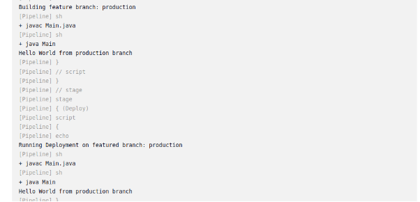
