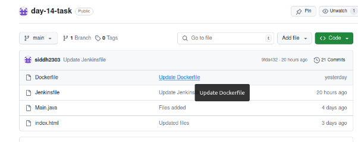
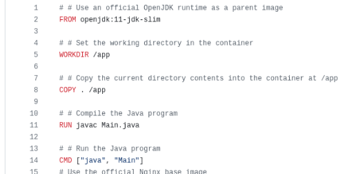
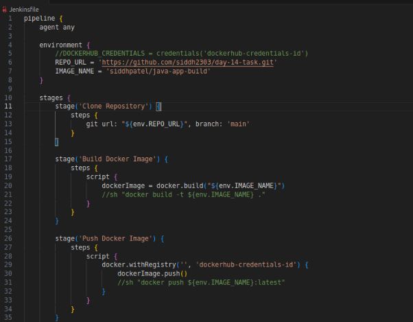
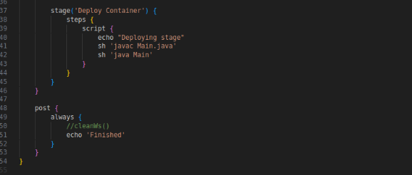
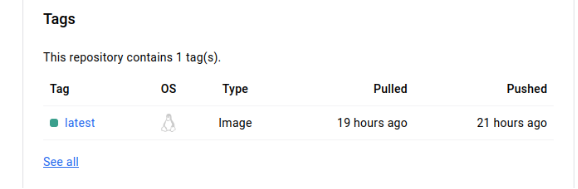
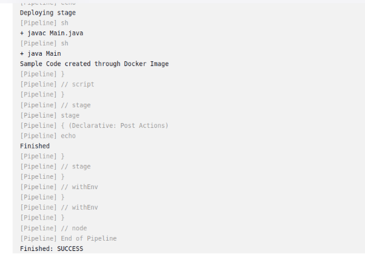

####
**Project 01**
#### **Problem Statement:**
You are tasked with setting up a CI/CD pipeline using Jenkins to streamline the deployment process of a simple Java application. The pipeline should accomplish the following tasks:

1. **Fetch the Dockerfile**: The pipeline should clone a GitHub repository containing the source code of the Java application and a Dockerfile.
1. **Create a Docker Image**: The pipeline should build a Docker image from the fetched Dockerfile.
1. **Push the Docker Image**: The pipeline should push the created Docker image to a specified DockerHub repository.
1. **Deploy the Container**: The pipeline should deploy a container using the pushed Docker image.
#### **Deliverables:**
1. **GitHub Repository**: A GitHub repository containing:
   1. The source code of a simple Java application.
   1. A Dockerfile for building the Docker image.

**Dockerfile:**

1. **Jenkins Pipeline Script**: A Jenkinsfile (pipeline script) that:
   1. Clones the GitHub repository.
   1. Builds the Docker image.
   1. Pushes the Docker image to DockerHub.
   1. Deploys a container using the pushed image.

**Jenkinsfile:**

1. **DockerHub Repository**: A DockerHub repository where the Docker images will be stored.

1. **Jenkins Setup**:
   1. Jenkins installed and configured on a local Ubuntu machine.
   1. Required plugins installed (e.g., Git, Docker, Pipeline).

