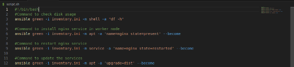

**Project 1:
**Deliverables:**

1. **Control Node Setup:**
   1. Install Ansible on the control node.
   1. Configure SSH key-based authentication between the control node and managed nodes.
1. **Managed Nodes Configuration:**
   1. Ensure all managed nodes are properly configured to be controlled by Ansible.
   1. Verify connectivity and proper setup between the control node and managed nodes.
1. **Documentation:**
   1. Detailed installation and configuration steps.
   1. Troubleshooting guide for common issues encountered during deployment.

### 
### **Project 2: Ad-Hoc Ansible Commands**
**Problem Statement:** Your organization needs to perform frequent, one-off administrative tasks across a fleet of servers. These tasks include checking disk usage, restarting services, and updating packages. You are required to use Ansible ad-hoc commands to accomplish these tasks efficiently.

**Deliverables:**

1. **Task Execution:**
   1. Execute commands to check disk usage across all managed nodes.

1. Restart a specific service on all managed nodes.

1. Update all packages on a subset of managed nodes.

1. **Command Scripts:**
   1. Create a script or documentation for each task, detailing the ad-hoc command used and its output.

1. **Documentation:**
   1. Provide a comprehensive guide on using Ansible ad-hoc commands.
   1. Include examples of common administrative tasks that can be performed with ad-hoc commands.

### **Project 3: Working with Ansible Inventories**
**Problem Statement:** You need to manage a dynamic and diverse set of servers, which requires an organized and flexible inventory system. The project involves creating static and dynamic inventories in Ansible to categorize servers based on different attributes such as environment (development, staging, production) and roles (web servers, database servers).

**Deliverables:**

1. **Static Inventory:**
   1. Create a static inventory file with different groups for various environments and roles.
   1. Verify that the inventory is correctly structured and accessible by Ansible.

**Inventory.ini:**

1. **Dynamic Inventory:**
   1. Implement a dynamic inventory script or use a dynamic inventory plugin.
   1. Configure the dynamic inventory to categorize servers automatically based on predefined criteria.
1. **Documentation:**
   1. Instructions for setting up and using static and dynamic inventories.
   1. Examples of playbooks utilizing both types of inventories.
### **Project 4: Ansible Playbooks: The Basics**
**Problem Statement:** Your team needs to automate repetitive tasks such as installing packages, configuring services, and managing files on multiple servers. The project involves writing basic Ansible playbooks to automate these tasks, ensuring consistency and efficiency in the operations.

**Deliverables:**

1. **Playbook Creation:**
   1. Write a playbook to install a specific package on all managed nodes.
   1. Create a playbook to configure a service with specific parameters.
   1. Develop a playbook to manage files, such as creating, deleting, and modifying files on managed nodes.

**Main.yaml:**

1. **Testing and Verification:**
   1. Test the playbooks to ensure they run successfully and perform the intended tasks.
   1. Validate the changes made by the playbooks on the managed nodes.

1. **Documentation:**
   1. Detailed explanation of each playbook, including the tasks and modules used.
   1. Guide on how to run the playbooks and interpret the results.
### **Project 5: Ansible Playbooks - Error Handling**
**Problem Statement:** In a complex IT environment, tasks automated by Ansible playbooks may encounter errors due to various reasons such as incorrect configurations, unavailable resources, or network issues. The project focuses on implementing error handling in Ansible playbooks to ensure resilience and proper reporting of issues.

**Deliverables:**

1. **Playbook with Error Handling:**
   1. Write a playbook that includes tasks likely to fail, such as starting a non-existent service or accessing a non-existent file.
   1. Implement error handling strategies using modules like block, rescue, and always.

**Error.yaml:**

1. **Logging and Notifications:**
   1. Configure the playbook to log errors and notify administrators of any issues encountered during execution.
   1. Use Ansible modules to send notifications via email or other communication channels.

