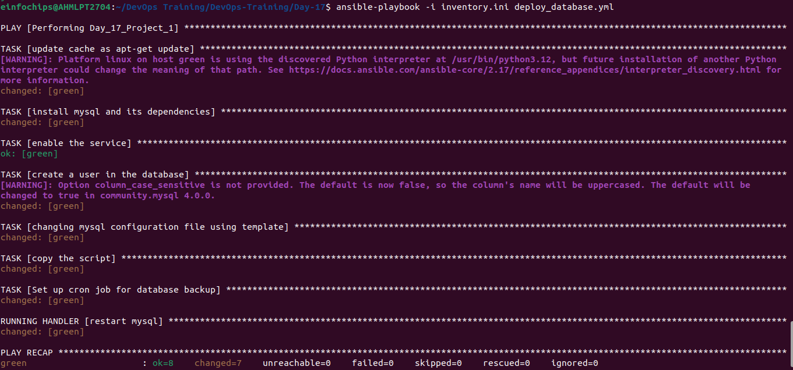

# Project 01
## Deploy a Database Server with Backup Automation
### Objective: Automate the deployment and configuration of a MySQL database server on an Ubuntu instance hosted on AWS, and set up regular backups.
### Objective: Automate the deployment, configuration, and backup of a MySQL database server on an Ubuntu instance using Ansible.
 1) Ansible Inventory File
 - inventory.ini:
 ```
 [web]
green ansible_host=54.193.241.94 ansible_user=ubuntu ansible_ssh_private_key_file=~/.ssh/ansible-new.pem

 ```

  2) Ansbile Playbook file
   - deploy_database.yaml
   ```
   - name: Performing Day_17_Project_1
  hosts: web
  gather_facts: no
  become: yes
  vars:
    mysql_custom_settings:
      max_connections: 200
      query_cache_size: 16M

  tasks:
    - name: update cache as apt-get update
      apt:
        update_cache: yes

    - name: install mysql and its dependencies
      apt:
        name: ['mysql-server', 'mysql-client', 'python3-mysqldb', 'libmysqlclient-dev']
        state: present

    - name: enable the service
      service:
        name: mysql
        state: started
        enabled: yes

    - name: create a user in the database
      mysql_user:
        name: siddh
        password: siddh1234
        priv: '*.*:ALL'
        host: '%'
        state: present

# mysql -u siddh -p
# priv: '*.*:ALL' means user siddh will have all privileges (ALL) on all databases (*) and all tables (*).
# host: '%' means This specifies from which hosts the user can connect. The wildcard character % means the user can connect from any host.

    - name: changing mysql configuration file using template
      template:
        src: "/home/einfochips/DevOps Training/DevOps-Training/Day-17/Project_1/templates/my.cnf.j2"
        dest: "/etc/mysql/my.cnf.j2"
      notify:
        - restart mysql

    - name: copy the script
      ansible.builtin.copy:
        src: "/home/einfochips/DevOps Training/DevOps-Training/Day-17/Project_1/scripts/backup.sh"
        dest: "/home/ubuntu/backup.sh"
        mode: '777'

    - name: Set up cron job for database backup
      cron:
        name: "Daily MySQL Backup"
        minute: "*/30"
        job: /home/ubuntu/backup.sh

  handlers:
    - name: restart mysql
      service:
        name: mysql
        state: restarted
   ```
   3) Jinja2 Template:
   - templates/my.cnf.j2
   ```
   [mysqld]
user = mysql
pid-file = /var/run/mysqld/mysqld.pid
socket = /var/run/mysqld/mysqld.sock
port = 3306
basedir = /usr
datadir = /var/lib/mysql
tmpdir = /tmp
lc-messages-dir = /usr/share/mysql
skip-external-locking

# Instead of skip-networking the default is now to listen only on
# localhost which is more compatible and is not less secure.
bind-address = 0.0.0.0

# Disabling symbolic-links is recommended to prevent assorted security risks
symbolic-links = 0

# Custom settings

{{ setting }} = {{ value }}


[mysqld_safe]
log-error = /var/log/mysql/error.log
pid-file = /var/run/mysqld/mysqld.pid

!includedir /etc/mysql/conf.d/
   ```
   4) Backup Script
   - scripts/backup.sh
   ```
   #!/bin/bash

# Database credentials
USER="siddh"
PASSWORD="siddh1234"
HOST="localhost"
DB_NAME="my_database"

# Other options
BACKUP_PATH='/ubuntu/backup/directory'
DATE=$(date +%F)

# Set default file permissions
umask 177

# Dump database into SQL file
mysqldump --user=$USER --password=$PASSWORD --host=$HOST $DB_NAME > $BACKUP_PATH/$DB_NAME-$DATE.sql

# Remove backups older than 7 days
find $BACKUP_PATH/* -mtime +7 -exec rm {} \;
   ```

## Output

