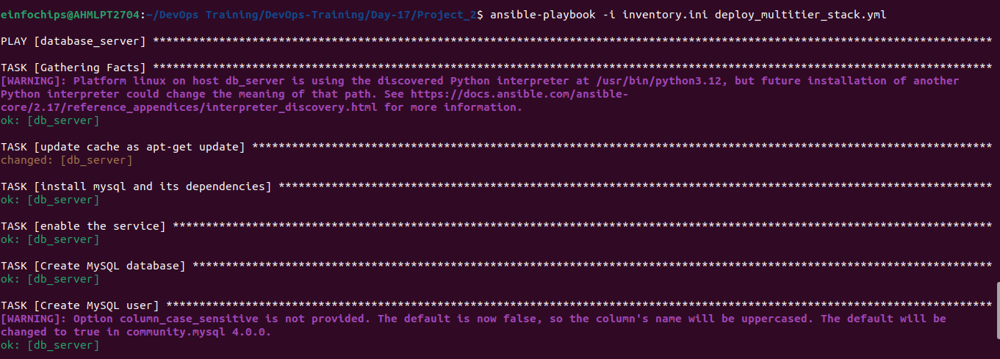
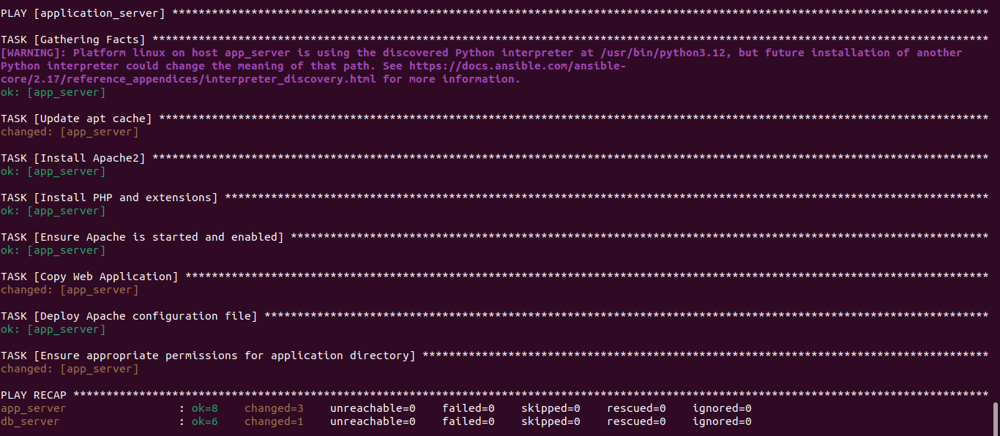
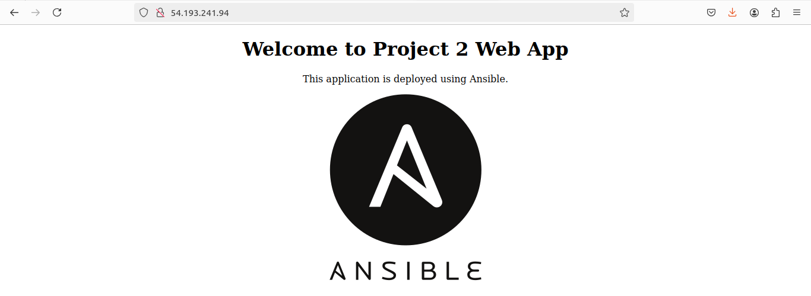

# Project 02

### Objective: Automate the setup of a multi-tier web application stack with separate database and application servers using Ansible.
 1) Ansible Inventory File
 - inventory.ini:
 ```
[database_server]
db_server ansible_host=54.193.241.94 ansible_user=ubuntu ansible_ssh_private_key_file=~/.ssh/ansible-new.pem

[application_server]
app_server ansible_host=54.193.241.94 ansible_user=ubuntu ansible_ssh_private_key_file=~/.ssh/ansible-new.pem
 ```

  2) Ansbile Playbook file
   - deploy_multitier_stack.yaml
   ```
   ---
- hosts: database_server
  become: yes
  vars:
    mysql_root_password: "siddh1234"
    mysql_database: "webapp_db"
    mysql_user: "webapp_user"
    mysql_password: "siddh1234"
  tasks:
    - name: update cache as apt-get update
      apt:
        update_cache: yes

    - name: install mysql and its dependencies
      apt:
        name: ['mysql-server', 'mysql-client', 'python3-mysqldb', 'libmysqlclient-dev']
        state: present

    - name: enable the service
      service:
        name: mysql
        state: started
        enabled: yes

    - name: Create MySQL database
      mysql_db:
        name: "{{ mysql_database }}"
        state: present

    - name: Create MySQL user
      mysql_user:
        name: "{{ mysql_user }}"
        password: "{{ mysql_password }}"
        priv: "{{ mysql_database }}.*:ALL"
        state: present

- hosts: application_server
  become: yes
  vars:
    app_repo_url: "/home/einfochips/DevOps Training/DevOps-Training/Day-17/Project_2/files/index.html"
    app_directory: "/var/www/html/"
    db_host: "{{ hostvars['db_server']['ansible_host'] }}"
    db_name: "webapp_db"
    db_user: "webapp_user"
    db_password: "secure_user_password"
  tasks:
    - name: Update apt cache
      apt:
        update_cache: yes

    - name: Install Apache2
      apt:
        name: apache2
        state: present

    - name: Install PHP and extensions
      apt:
        name:
          - php
          - php-mysql
          - libapache2-mod-php
        state: present

    - name: Ensure Apache is started and enabled
      service:
        name: apache2
        state: started
        enabled: yes

    - name: Copy Web Application
      ansible.builtin.copy:
        src: "{{ app_repo_url }}"
        dest: "{{ app_directory }}"
    - name: Deploy Apache configuration file
      template:
        src: templates/apache2.conf.j2
        dest: /etc/apache2/apache2.conf
        owner: root
        group: root
        mode: 0644
      notify:
        - Restart Apache


    - name: Ensure appropriate permissions for application directory
      file:
        path: "{{ app_directory }}"
        owner: www-data
        group: www-data
        state: directory
        recurse: yes
  handlers:
    - name: Restart Apache
      service:
        name: apache2
        state: restarted
   ```
   3) Jinja2 Template:
   - templates/apache2.conf.j2
   ```
   # This is the main Apache server configuration file. It contains the
# configuration directives that give the server its instructions.
# See <URL:http://httpd.apache.org/docs/2.4/> for detailed information about
# the directives and parameters.

ServerRoot "/etc/apache2"

# The file with the process id
PidFile ${APACHE_PID_FILE}

# Timeout: The number of seconds before receives and sends time out.
Timeout 300

# KeepAlive: Whether or not to allow persistent connections (more than
# one request per connection). Set to "Off" to deactivate.
KeepAlive On

# MaxKeepAliveRequests: The maximum number of requests to allow
# during a persistent connection. Set to 0 to allow an unlimited amount.
# We recommend you leave this number high, for maximum performance.
MaxKeepAliveRequests 100

# KeepAliveTimeout: Number of seconds to wait for the next request from the
# same client on the same connection.
KeepAliveTimeout 5

# These need to be set in /etc/apache2/envvars
User ${APACHE_RUN_USER}
Group ${APACHE_RUN_GROUP}

# HostnameLookups: Log the names of clients or just their IP addresses
HostnameLookups Off

# ErrorLog: The location of the error log file.
ErrorLog ${APACHE_LOG_DIR}/error.log

# LogLevel: Control the number of messages logged to the error_log.
LogLevel warn

# Include module configuration:
IncludeOptional mods-enabled/*.load
IncludeOptional mods-enabled/*.conf

# Include all the user configurations:
IncludeOptional conf-enabled/*.conf

# Include ports listing
Include ports.conf

# The default server name
ServerName {{ ansible_fqdn }}

# Global configuration
Mutex file:${APACHE_LOCK_DIR} default
PidFile ${APACHE_PID_FILE}
Timeout 300
KeepAlive On

<Directory />
    AllowOverride none
    Require all denied
</Directory>

<Directory /usr/share>
    AllowOverride none
    Require all granted
</Directory>

<Directory /var/www/>
    Options Indexes FollowSymLinks
    AllowOverride None
    Require all granted
</Directory>

<Directory /var/www/html/webapp>
    Options Indexes FollowSymLinks
    AllowOverride All
    Require all granted
</Directory>

AccessFileName .htaccess

<FilesMatch "^\.ht">
    Require all denied
</FilesMatch>

LogFormat "%v:%p %h %l %u %t \"%r\" %>s %b" vhost_combined
LogFormat "%h %l %u %t \"%r\" %>s %b" common
LogFormat "%{Referer}i -> %U" referer
LogFormat "%{User-agent}i" agent

CustomLog ${APACHE_LOG_DIR}/access.log combined

<IfModule alias_module>
    ScriptAlias /cgi-bin/ /usr/lib/cgi-bin/
    <Directory "/usr/lib/cgi-bin">
        AllowOverride None
        Options +ExecCGI -MultiViews +SymLinksIfOwnerMatch
        Require all granted
    </Directory>
</IfModule>

<IfModule mime_module>
    TypesConfig /etc/mime.types
    AddType application/x-compress .Z
    AddType application/x-gzip .gz .tgz
    AddType text/html .shtml
    AddOutputFilter INCLUDES .shtml
</IfModule>

IncludeOptional sites-enabled/*.conf
   ```
   4) Backup Script
   - files/index.html
   ```
   <!DOCTYPE html>
<html>
  <head>
      <title>My Web Application</title>
  </head>
  <body>
      <center>
          <h1>Welcome to Project 2 Web App</h1>
          <p>This application is deployed using Ansible.</p>

          
      </center>
  </body>
</html>
   ```

## Running Ansible Playbook File
#### Database Server


#### Application Server


### Output
