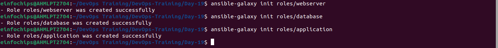
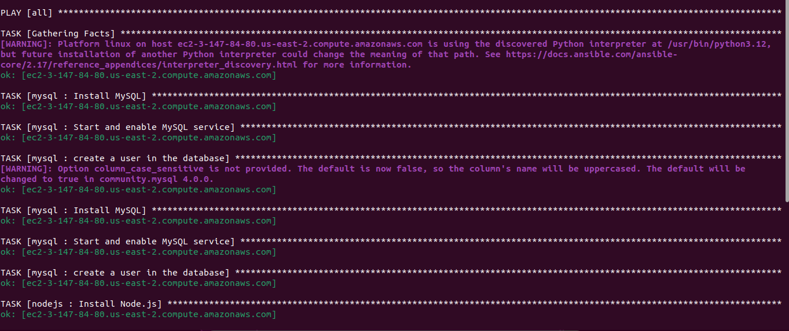
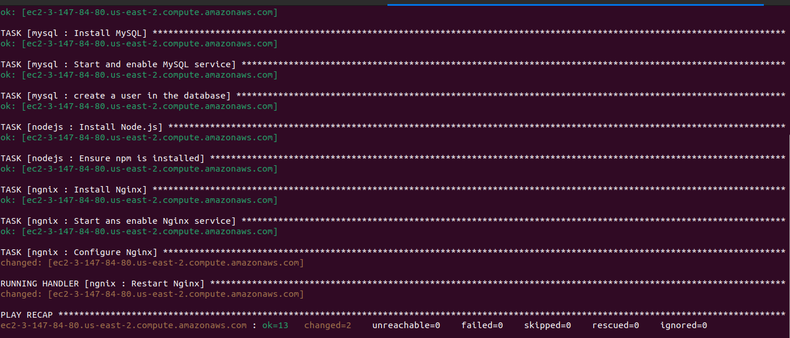

# Project Overview

### Milestone 1: Environment Setup
#### Objective: Configure your development environment and AWS infrastructure.
#### Tasks: Launch an AWS EC2 instance running Ubuntu. Install Ansible and Git on your local machine or control node.

- Install Ansible
```
sudo apt update
sudo apt install ansible
```
- Install Git
```
sudo apt install git
```

- Launch EC2 instance
```
ssh -i ansible-new.pem ubuntu@54.XX1.74.226
```

### Milestone 2: Create Ansible Role Structure
#### Objective: Organize your Ansible project using best practices for playbooks and roles

```
ansible-galaxy init webserver
ansible-galaxy init database
ansible-galaxy init application
```


### Milestone 3: Version Control with Git
#### Objective: Implement version control for your Ansible project.

```
git init

echo "*.retry" >> .gitignore
echo "*.log" >> .gitignore

git add .
git commit -m "Initial Commit"
git remote add origin https://github.com/siddh2303/day-19-task.git
git push -u origin master
```

### Milestone 4: Develop Ansible Roles
#### Objective: Write Ansible roles for web server, database, and application deployment.

- roles/webserver/tasks/main.yml
```
---
- name: Install Nginx 
  apt:
    name: nginx
    state: present
  become: yes
 
- name: Start ans enable Nginx service
  service:
    name: nginx
    state: started
    enabled: true
  become: yes
 
- name: Configure Nginx
  template:
    src: index.html.j2
    dest: /var/www/html/index.html
  notify: Restart Nginx
```
- roles/webserver/handlers/main.yml
```
---
- name: Restart Nginx
  systemd:
    name: nginx
    state: restarted
```
- roles/webserver/meta/main.yml
```
dependencies: 
  - role: application
```
- roles/webserver/files/index.html
```
<html>
    <head>
        <title>Day-18</title>
    </head>
    <body>
        <center>
            <h1>Hello from Frontend</h1>
        </center>
    </body>
</html>
```
- roles/application/tasks/main.yml
```
---
- name: Install Node.js 
  apt:
    name: nodejs
    state: present
    update_cache: yes

- name: Ensure npm is installed 
  apt:
    name: npm
    state: present
```
- roles/application/meta/main.yml
```
dependencies: 
  - role: database
    when: ansible_os_family == "Debian"
```

- roles/database/tasks/main.yml
```
---
- name: Install MySQL
  apt:
    update_cache: yes
    name: ['mysql-server','mysql-client','python3-mysqldb','libmysqlclient-dev']
    state: present
  become: yes

- name: Start and enable MySQL service
  service:
    name: mysql
    state: started
    enabled: true
  become: yes
  
- name: create a user in the database
  mysql_user:
    name: "{{ mysql_user }}"
    password: "{{ mysql_password }}"
    priv: '*.*:ALL'
    host: '%'
    state: present
  become: yes
```
- roles/database/vars/main.yml
```
---
# vars file for roles/mysql
mysql_user: siddh
mysql_password: siddh1234
```

### Milestone 5: Dynamic Inventory Script
#### Objective: Use dynamic inventory scripts to manage AWS EC2 instances.
#### Install awscli and configure it
```
sudo apt update
sudo apt install awscli
aws configure
```
- ansible.cfg
```
[defaults]
roles_path= ./roles
inventory = dynamic_inventory.py
```
- dynamic-inventory.py
```
#!/usr/bin/env python3

import json
import boto3

def get_inventory():
    ec2 = boto3.client('ec2', region_name='us-west-1')  # Specify your region
    response = ec2.describe_instances(Filters=[{'Name': 'tag:Name', 'Values': ['Siddh']}])
    
    inventory = {
        'all': {
            'hosts': [],
            'vars': {}
        },
        '_meta': {
            'hostvars': {}
        }
    }
    
    ssh_key_file = '/home/einfochips/.ssh/ansible-new.pem'  # Path to your SSH private key file
    ssh_user = 'ubuntu'  # SSH username
    
    for reservation in response['Reservations']:
        for instance in reservation['Instances']:
            public_dns = instance.get('PublicDnsName', instance['InstanceId'])
            inventory['all']['hosts'].append(public_dns)
            inventory['_meta']['hostvars'][public_dns] = {
                'ansible_host': instance.get('PublicIpAddress', instance['InstanceId']),
                'ansible_ssh_private_key_file': ssh_key_file,
                'ansible_user': ssh_user
            }

    return inventory

if __name__ == '__main__':
    print(json.dumps(get_inventory()))
```
- Change the execution of inventory file
```
chmod +x dynamic_inventory.py
```
### Milestone 6: Playbook Development and Deployment 
#### Objective: Create and execute an Ansible playbook to deploy the web application.

- site.yml
```
---
- name: Deploy web application
  hosts: all
  become: yes
  vars_files:
    - vars/main.yml

  roles:
    - webserver
    - database
    - application
```

- To run the playbook file with this inventory
```
ansible-playbook -i dynamic_inventory.py site.yml
```

### Output




