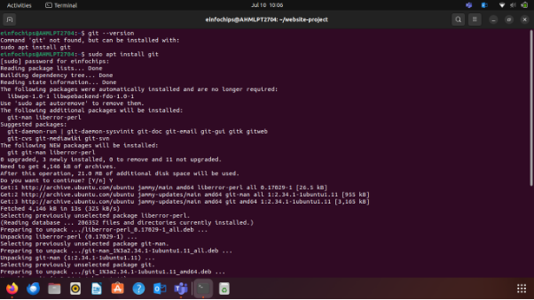
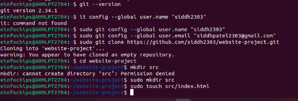
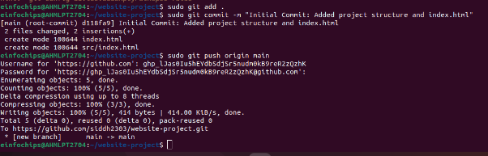
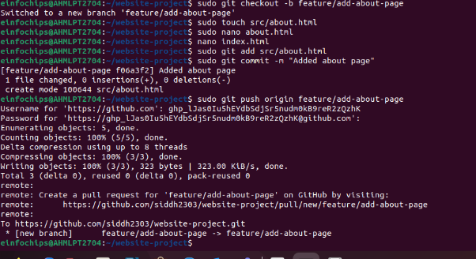
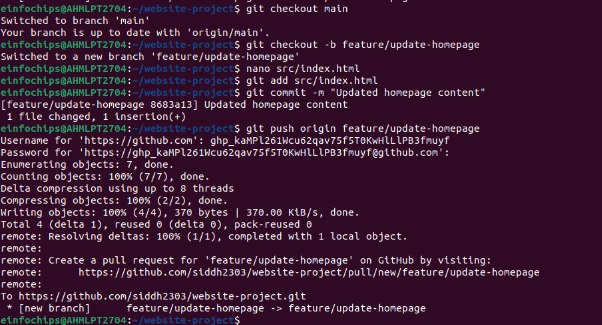
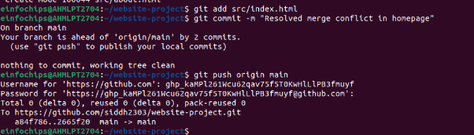
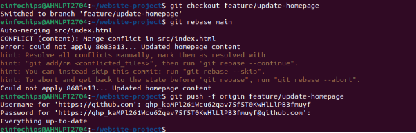
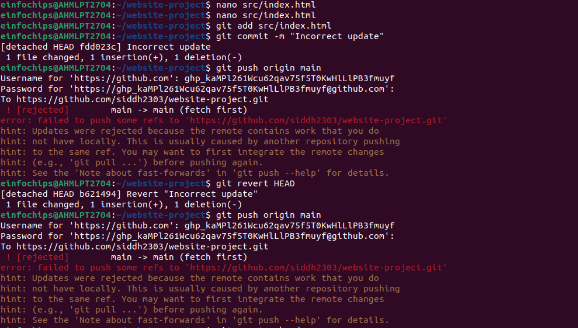
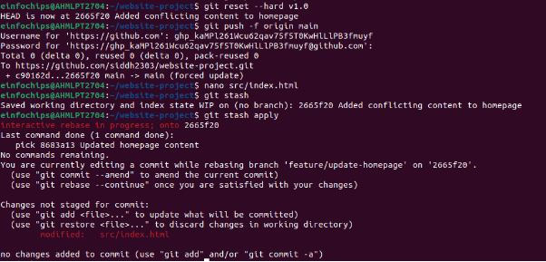

### **Git Project**

![ref1]
#### **Project Setup (15 minutes)**
1. **Install Git**: Ensure Git is installed on your system. Verify with git --version.

![ref1]
#### 
#### **Install git in out pc.**

#### **Run configuration command to integrate the git locally.**

#### **Create index.html file and push it in main.**
#### **Exercise 2: Merging and Handling Merge Conflicts (15 minutes)**

![ref1]
#### 
#### **Exercise 3: Rebasing (10 minutes)**

![ref1]
#### **Exercise 4: Pulling and Collaboration (10 minutes)**

![ref1]
#### **Exercise 5: Versioning and Rollback (15 minutes)**
#### 