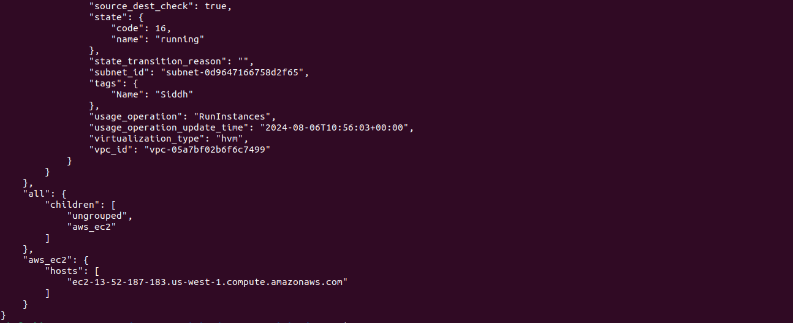
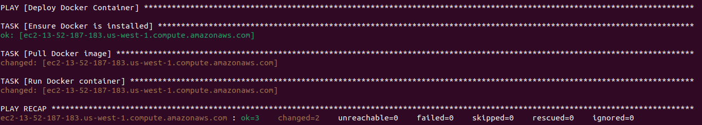

# Project 1

### 1) Inventory Plugins
#### Activity: Configure a dynamic inventory plugin to manage a growing number of web servers dynamically. Integrate the plugin with Ansible to automatically detect and configure servers in various environments.

- aws_ec2.yml
```
plugin: aws_ec2
regions:
  - us-west-1
filters:
  instance-state-name:
    - running
  tag:Name:
    - Siddh
hostnames:
  - dns-name
compose:
  ansible_host: public_dns_name
```

### 2) Performance Tuning
#### Activity: Tune Ansible performance by adjusting settings such as parallel execution (forks), optimizing playbook tasks, and reducing playbook run time.
- deploy.yml
```
---
- name: Optimize Deployment
  hosts: all
  gather_facts: yes

  tasks:
    - name: Install Nginx 
      apt:
        name: nginx
        state: present
      become: yes

    - name: Wait for nginx to be installed
      async_status:
        jid: "{{ item.ansible_job_id }}"
      register: async_results
      until: async_results.finished
      retries: 30
      delay: 10
      with_items:
        - "{{ ansible_job_ids }}"
      when: async_results.ansible_job_id is defined
    - name: Ensure /var/www/html exists
      file:
        path: /var/www/html
        state: directory
        owner: ubuntu
        group: ubuntu
        mode: '0755'
      become: yes
    - name: Configure Nginx
      copy:
        src: index.html
        dest: /var/www/html/index.html
        owner: ubuntu
        group: ubuntu
        mode: '0644'
      notify: Restart nginx

  handlers:
    - name: Restart nginx
      service:
        name: nginx
        state: restarted
```

- ansible.cfg
```
[defaults]
forks = 50
gathering = smart
fact_caching = jsonfile
fact_caching_connection = /tmp/ansible_cache
host_key_checking = False

[ssh_connection]
ssh_args = -o ControlMaster=auto -o ControlPersist=60s
pipelining = True
```

### 3) Debugging and Troubleshooting Playbooks
#### Activity: Implement debugging strategies to identify and resolve issues in playbooks, including setting up verbose output and advanced error handling.
#### - Debugging
- debug.yml
```
---
- name: Optimize Deployment
  hosts: all
  tasks:
    - name: Ensure the web server is running
      service:
        name: nginx
        state: started
      failed_when: result is failed
      ignore_errors: yes
      register: result

    - name: Log error if web server failed to start
      debug:
        msg: "Failed to start nginx"
      when: result is failed
```
```
ansible-playbook -i dynamic_inventory.py debug.yml
```

#### - Troubleshooting


- Verbose Output
```
ansible-playbook -i dynamic_inventory.py deploy.yml -vv
```


### 4) Exploring Advanced Modules
#### manage containerized applications and aws_ec2 for AWS infrastructure management, demonstrating their integration and usage.

- Creating a docker container inside worker node.
 - docker-container.yml
 ```
 ---
- name: Deploy Docker Container
  hosts: all
  become: yes
  tasks:
    - name: Ensure Docker is installed
      apt:
        name: docker.io
        state: present
      when: ansible_os_family == "Debian"

    - name: Pull Docker image
      docker_image:
        name: nginx
        source: pull

    - name: Run Docker container
      docker_container:
        name: my_nginx_container
        image: nginx
        state: started
        ports:
          - "81:80"
 ```
 