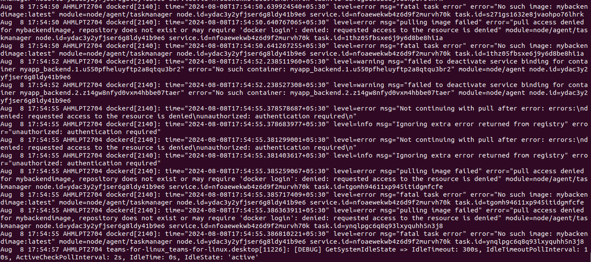

# Project 01: 

### Project Overview:
#### The goal of this capstone project is to combine shell scripting with system monitoring and log management practices. You will create a set of automated tools using shell scripts to manage logs, monitor system performance using Prometheus and Node Exporter, and generate insights using PromQL queries. The project will require a systematic approach, covering scripting fundamentals, log management, and monitoring setup.

### 1) Shell Scripts for Basic Operations:
- Write shell scripts to perform basic system operations, such as checking disk usage, memory usage, and CPU load.
```
#!/bin/bash

# Log file path
log_file="/var/log/sys_metrics.log"

# Function to check disk usage
check_disk_usage() {
    echo "Checking Disk Usage..." >> $log_file
    disk_usage=$(df -h)
    if [ $? -ne 0 ]; then
        echo "Error: Failed to get disk usage" | tee -a $log_file
        exit 1
    fi
    echo "$disk_usage" >> $log_file
    echo "---------------------------------" >> $log_file
}

# Function to check memory usage
check_memory_usage() {
    echo "Checking Memory Usage..." >> $log_file
    memory_usage=$(free -m)
    if [ $? -ne 0 ]; then
        echo "Error: Failed to get memory usage" | tee -a $log_file
        exit 1
    fi
    echo "$memory_usage" >> $log_file
    echo "---------------------------------" >> $log_file
}

# Function to check CPU load
check_cpu_load() {
    echo "Checking CPU Load..." >> $log_file
    cpu_load=$(uptime)
    if [ $? -ne 0 ]; then
        echo "Error: Failed to get CPU load" | tee -a $log_file
        exit 1
    fi
    echo "$cpu_load" >> $log_file
    echo "---------------------------------" >> $log_file
}

# Main script execution
echo "System Metrics Report - $(date)" >> $log_file
check_disk_usage
check_memory_usage
check_cpu_load
echo "Report Completed" >> $log_file
echo "=================================" >> $log_file
```


### 2) Log Management Script: 
- Develop a script to automate log management tasks such as log rotation and archiving. This script should include the ability to compress old logs and delete logs older than a specified number of days.

Go to logrotate file
```
sudo nano /etc/logrotate.d/apache2
```
Content:
```
/var/log/apache2/*.log {
    daily
    missingok
    rotate 14
    compress
    delaycompress
    notifempty
    create 640 root adm
    sharedscripts
    prerotate
	if [ -d /etc/logrotate.d/httpd-prerotate ]; then
	    run-parts /etc/logrotate.d/httpd-prerotate
	fi
    endscript
    postrotate
	if pgrep -f ^/usr/sbin/apache2 > /dev/null; then
	    invoke-rc.d apache2 reload 2>&1 | logger -t apache2.logrotate
	fi
    endscript
}
```
To run this file
```
sudo logrotate -d /etc/logrotate.d/apache2
```

### 3) Advanced Shell Scripting - Loops, Conditions, Functions, and Error Handling:
#### Refactor the previous scripts to include loops, conditionals, and functions for modularity. Implement error handling to manage potential issues during script execution.

- script_3.sh
```
#!/bin/bash

# Function to calculate the average of numbers in a file
calculate_average() {
    local file=$1
    local total=0
    local count=0

    while read -r line
    do
        if [[ $line =~ ^[0-9]+$ ]]; then
            total=$((total + line))
            count=$((count + 1))
        else
            echo "Warning: Non-numeric value '$line' ignored."
        fi
    done < "$file"

    if [ $count -eq 0 ]; then
        echo "Error: No valid numbers in the file."
        exit 1
    fi

    echo "Average: $((total / count))"
}

# Main script
read -p "Enter the file name: " filename

# Error handling for file existence
if [ ! -f $filename ]; then
    echo "Error: File '$filename' not found!"
    exit 1
fi

# Call the function to calculate average
calculate_average $filename
```


### 4) Log Checking and Troubleshooting:
#### Write a script that reads through system and application logs, identifies common issues (e.g., out of memory, failed service starts), and provides troubleshooting steps based on log analysis.
- System logs having errors.
```
sudo tail -n 100 /var/log/syslog
```

- Application Logs
```
sudo tail -n 100 /var/log/apache2/error.log
```

- Search for Specific Errors or Patterns
```
sudo grep "authentication failure" /var/log/auth.log
```

### 5) Installation and Setup of Prometheus and Node Exporter:
#### Install and configure Prometheus and Node Exporter on the system. Ensure that Node Exporter is properly configured to collect system metrics.
- Install Prometheus
```
wget https://github.com/prometheus/prometheus/releases/download/v2.53.1/prometheus-2.53.1.linux-amd64.tar.gz
```


```
tar -xvf prometheus-2.53.1.linux-amd64.tar.gz
```


```
cd prometheus-2.53.1.linux-amd64/
./prometheus
```


- Install Node Exporter On VM
```
wget https://github.com/prometheus/node_exporter/releases/download/v1.8.2/node_exporter-1.8.2.linux-amd64.tar.gz
```

```
tar -xvf node_exporter-1.8.2.linux-amd64.tar.gz
```


### 6) Prometheus Query Language (PromQL) Basic Queries:
#### Create a series of PromQL queries to monitor system performance, such as CPU usage, memory usage, and disk I/O.
- prometheus.yml
```
- job_name: "node-exporter"

    # metrics_path defaults to '/metrics'
    # scheme defaults to 'http'.

    static_configs:
      - targets: ["13.52.211.131:9100"]
```
#### PromQL Examples:
- Querying Current CPU Usage
```
rate(node-exporter_cpu_seconds_total[5m])
```

- Filtering by Labels
```
node-exporter_cpu_seconds_total{mode="idle"}
```

- Querying Free Memory
```
node-exporter_memory_MemFree_bytes
```

