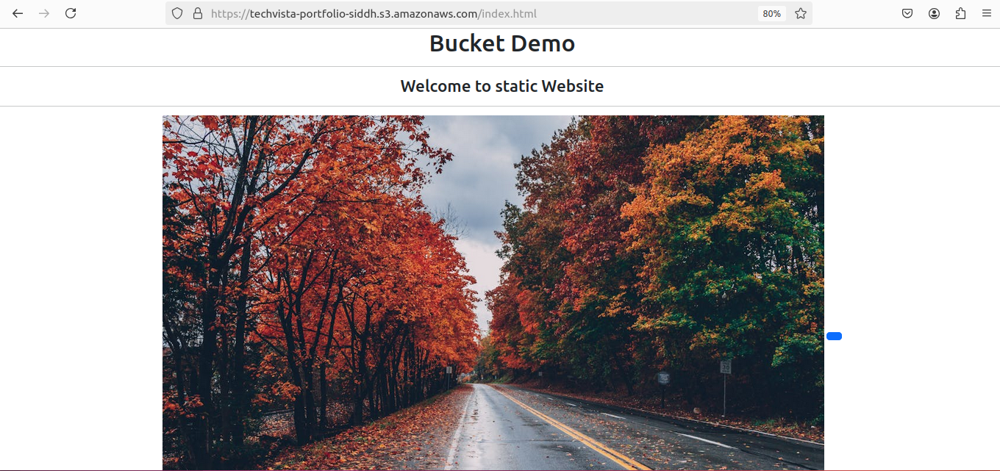

# Project
### Objective
#### To test your knowledge and skills in managing AWS S3 storage classes, lifecycle management, bucket policies, access control lists (ACLs), and hosting a static website on S3. You will apply their understanding in a practical scenario, ensuring you have mastered the critical aspects of AWS S3.
### 1) Create and Configure an S3 Bucket:
- Create an S3 bucket named techvista-portfolio-siddh

- Enable versioning on the bucket.

- Set up the bucket for static website hosting.

- Upload the provided static website files (HTML, CSS, images).
```
<!DOCTYPE html>
<html lang="en">
<head>
    <meta charset="UTF-8">
    <meta name="viewport" content="width=<device-width>, initial-scale=1.0">
    <title>AWS Bucket Demo</title>
    <link href="https://cdn.jsdelivr.net/npm/bootstrap@5.3.3/dist/css/bootstrap.min.css" rel="stylesheet" integrity="sha384-QWTKZyjpPEjISv5WaRU9OFeRpok6YctnYmDr5pNlyT2bRjXh0JMhjY6hW+ALEwIH" crossorigin="anonymous">
</head>
<body>
    <center>
        <h1>Bucket Demo</h1>
        <hr>
        <h3>Welcome to static Website</h3>
        <hr>
        
        <button class="btn btn-primary"></button>
    </center>
</body>
</html>
```
- Ensure the website is accessible via the S3 website URL.


### 2) Implement S3 Storage Classes:
- Classify the uploaded content into different S3 storage classes (e.g., Standard, Intelligent-Tiering, Glacier).
- Justify your choice of storage class for each type of content (e.g., HTML/CSS files vs. images).

### 3) Lifecycle Management:
- Create a lifecycle policy that transitions older versions of objects to a more cost-effective storage class (e.g., Standard to Glacier).
Set up a policy to delete non-current versions of objects after 90 days.
Verify that the lifecycle rules are correctly applied.


### 4) Configure Bucket Policies and ACLs:
- Create and attach a bucket policy that allows read access to everyone for the static website content.
```
{
    "Version": "2012-10-17",
    "Statement": [
        {
            "Effect": "Allow",
            "Principal": "*",
            "Action": "s3:GetObject",
            "Resource": "arn:aws:s3:::techvista-portfolio-siddh/*"
        }
    ]
}
```
### 5) Test and Validate the Configuration:
- Test the static website URL to ensure it is accessible.

