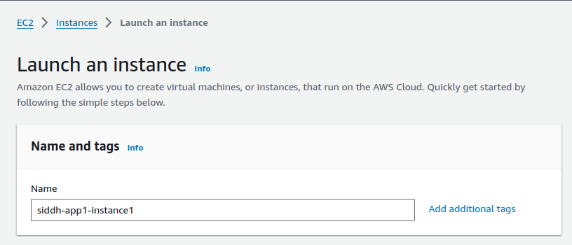
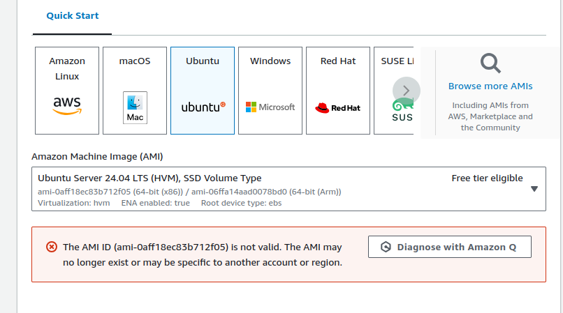
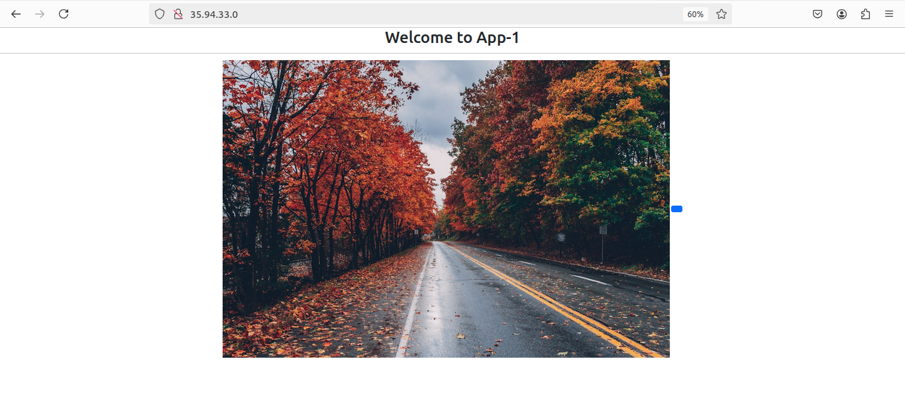
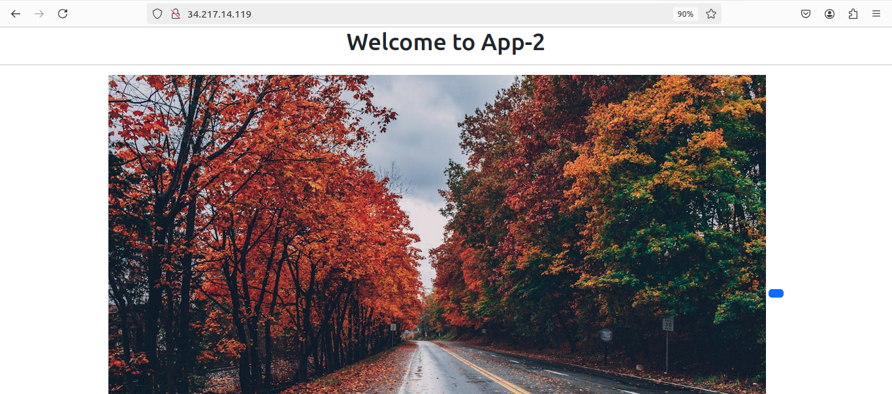
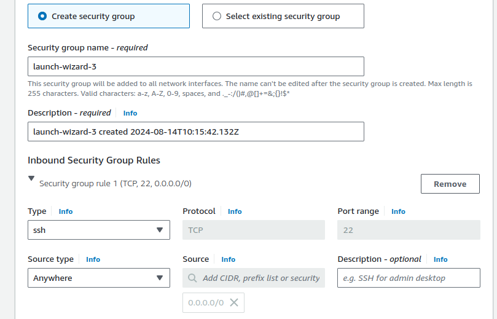
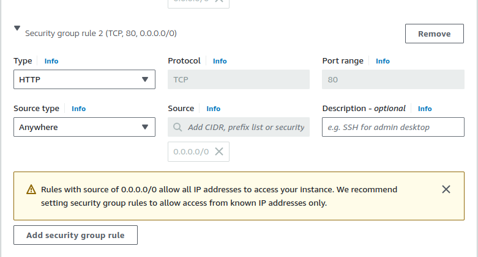
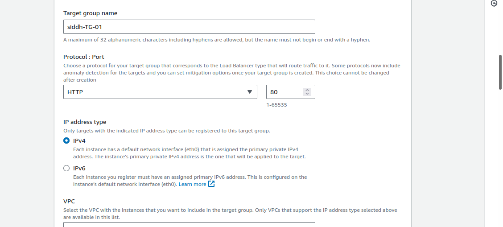
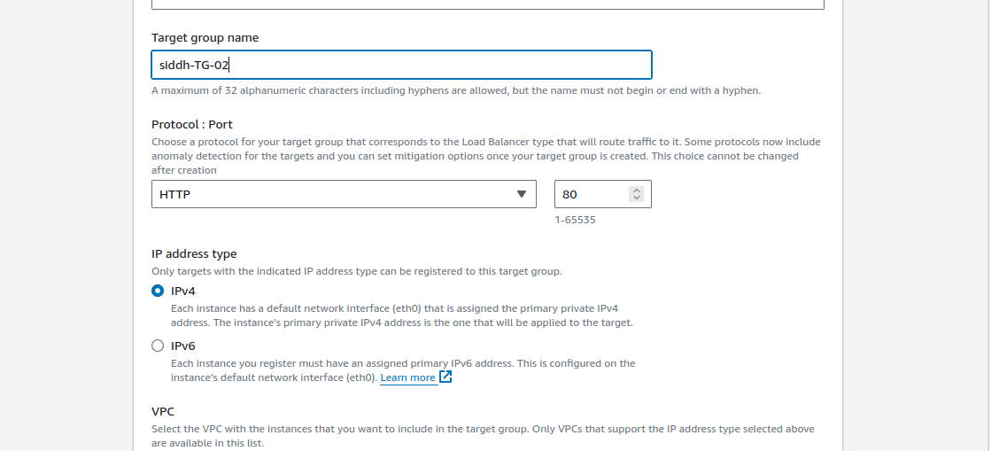
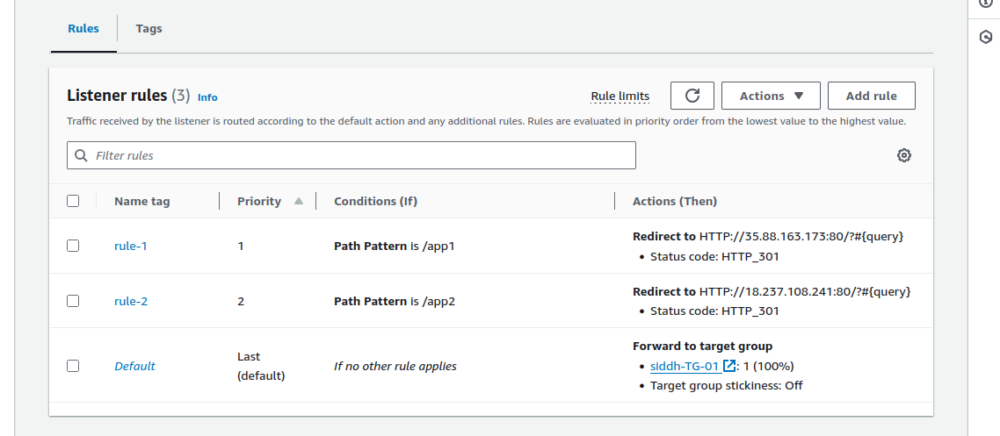
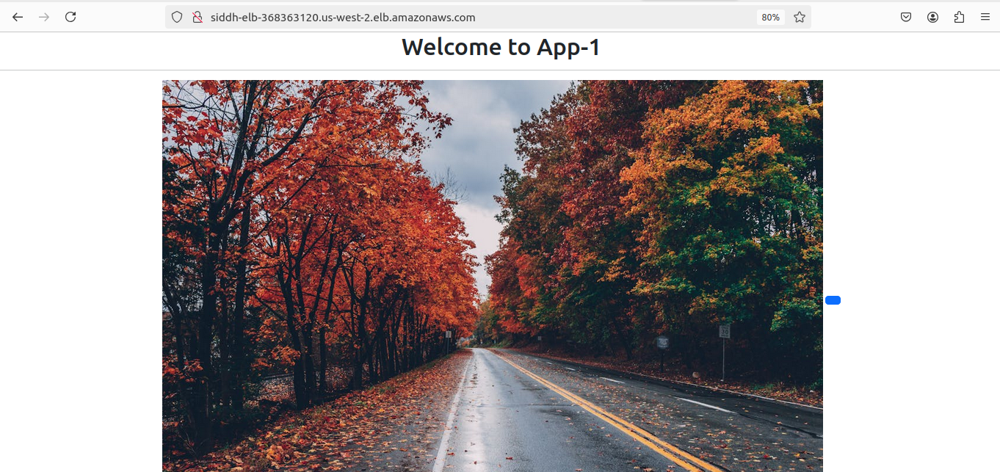

# Project
### Objective
#### To evaluate your skills in deploying a web application on AWS using EC2 instances, configuring security groups, and setting up an Application Load Balancer (ALB) with path-based routing. You will deploy two simple web applications, configure the ALB to route traffic based on the URL path, and terminate all resources once the project is complete.

### 1) EC2 Instance Setup
- Launch four EC2 t2.micro instances using the Amazon Linux 2 AMI.
- SSH into each instance and deploy a simple web application:


Deploy "App1" on two instances.
Deploy "App2" on the other two instances.
```
sudo apt-get update
sudo apt-get install apache2 -y
sudo mkdir -p /var/www/html/app1
sudo nano /var/www/html/app1/index.html
cd /etc/apache2
cd sites-available/
sudo cp 000-default.conf web.conf
sudo nano web.conf
sudo a2dissite 000-default.conf
sudo a2ensite web.conf
sudo service apache2 restart
```
- Assign tags to the instances for identification (e.g., "App1-Instance1," "App1-Instance2," "App2-Instance1," "App2-Instance2").




### 2) Security Group Configuration
- Create a security group for the EC2 instances that allows inbound HTTP (port 80) and SSH (port 22) traffic from your IP address.
- Create a security group for the ALB that allows inbound traffic on port 80.
- Attach the appropriate security groups to the EC2 instances and ALB.



### 3) Application Load Balancer Setup with Path-Based Routing 
- Set up an ALB in the same VPC and subnets as your EC2 instances.
- Configure the ALB with two target groups:
Target Group 1: For "App1" instances.
Target Group 2: For "App2" instances.


- Configure Path-Based Routing:



