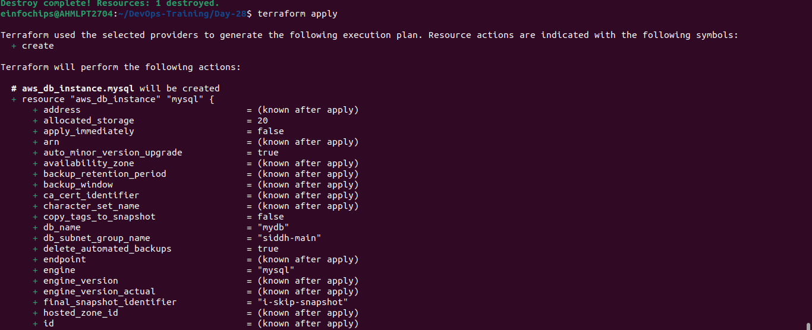
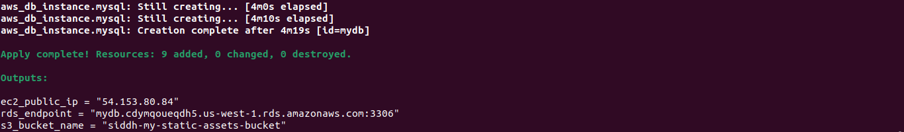

# Project: Deploying a Multi-Tier Architecture Application on AWS using Terraform
### Project Objective:
#### This project will assess your ability to deploy a multi-tier architecture application on AWS using Terraform. The deployment will involve using Terraform variables, outputs, and change sets. The multi-tier architecture will include an EC2 instance, an RDS MySQL DB instance, and an S3 bucket.
### 1) Setup Terraform Configuration
- Provider Configuration
```
aws configure
```
- main.tf
```
provider "aws" {
  region = var.region
}

resource "aws_vpc" "main" {
  cidr_block = "10.0.0.0/16"
  enable_dns_support = true
  enable_dns_hostnames = true
  tags = {
    Name = "siddh-vpc"
  }
}

resource "aws_subnet" "public" {
  vpc_id                  = aws_vpc.main.id
  cidr_block              = "10.0.1.0/24"
  availability_zone       = "us-west-1a" 
  map_public_ip_on_launch = true
  tags = {
    Name = "public"
  }
}
resource "aws_subnet" "public2" {
  vpc_id                  = aws_vpc.main.id
  cidr_block              = "10.0.2.0/24"
  availability_zone       = "us-west-1b" 
  map_public_ip_on_launch = true
  tags = {
    Name = "public2"
  }
}

resource "aws_security_group" "ec2_sg" {
  vpc_id = aws_vpc.main.id

  ingress {
    from_port   = 22
    to_port     = 22
    protocol    = "tcp"
    cidr_blocks = ["0.0.0.0/0"]
  }

  ingress {
    from_port   = 80
    to_port     = 80
    protocol    = "tcp"
    cidr_blocks = ["0.0.0.0/0"]
  }

  egress {
    from_port   = 0
    to_port     = 0
    protocol    = "-1"
    cidr_blocks = ["0.0.0.0/0"]
  }

  tags = {
    Name = "siddh-ec2_sg"
  }
}

resource "aws_security_group" "rds_sg" {
  vpc_id = aws_vpc.main.id

  ingress {
    from_port   = 3306
    to_port     = 3306
    protocol    = "tcp"
    security_groups = [aws_security_group.ec2_sg.id]
  }

  egress {
    from_port   = 0
    to_port     = 0
    protocol    = "-1"
    cidr_blocks = ["0.0.0.0/0"]
  }

  tags = {
    Name = "siddh-rds_sg"
  }
}

# ec2.tf

resource "aws_instance" "app_server" {  
  ami           = var.ami_id
  instance_type = var.instance_type
  subnet_id     = aws_subnet.public.id
  vpc_security_group_ids = [aws_security_group.ec2_sg.id]
  
  tags = {
    Name = "Siddh-Web-Instance"
  }
}

# rds.tf

resource "aws_db_instance" "mysql" {
  identifier           = "mydb"
  engine               = "mysql"
  instance_class       = "db.t3.micro"
  db_name              = var.db_name
  username             = var.db_username
  password             = var.db_password
  allocated_storage = 20
  publicly_accessible  = false
  vpc_security_group_ids = [aws_security_group.rds_sg.id]
  db_subnet_group_name = aws_db_subnet_group.siddh-main.name
  skip_final_snapshot  = false
  final_snapshot_identifier = "i-skip-snapshot"

  tags = {
    Name= "Siddh-db"
  }
}

resource "aws_db_subnet_group" "siddh-main" {
  name        = "siddh-main"
  subnet_ids   = [aws_subnet.public.id,aws_subnet.public2.id]  
  tags = {
    Name = "siddh-main_db_subnet_group"
  }
}

resource "aws_s3_bucket" "static_assets" {
  bucket = "siddh-my-static-assets-bucket"
  tags = {
    Name = "siddh-static_assets"
  }
}
```
- variables.tf
```
# AWS Region
variable "region" {
  description = "The AWS region to deploy the resources"
  default     = "us-west-1"  # Change as needed
}

# EC2 Instance Variables
variable "ami_id" {
  description = "AMI ID for the EC2 instance"
  default     = "ami-0ff591da048329e00"  # Example AMI ID
}

variable "instance_type" {
  description = "EC2 instance type"
  default     = "t2.micro"
}

# RDS MySQL DB Variables
variable "db_name" {
  description = "Database name"
  default     = "mydb"
}

variable "db_username" {
  description = "Database username"
  default     = "admin"
}

variable "db_password" {
  description = "Database password"
  default     = "password123"
}

# S3 Bucket Name
variable "s3_bucket_name" {
  description = "The name of the S3 bucket"
  default     = "app-static-assets"
}
```
- outputs.tf
```
output "ec2_public_ip" {
  value = aws_instance.app_server.public_ip
}

output "rds_endpoint" {
  value = aws_db_instance.mysql.endpoint
}

output "s3_bucket_name" {
  value = aws_s3_bucket.static_assets.bucket
}
```
### 2) Apply and Manage Infrastructure:


### 3) Testing and Validation


