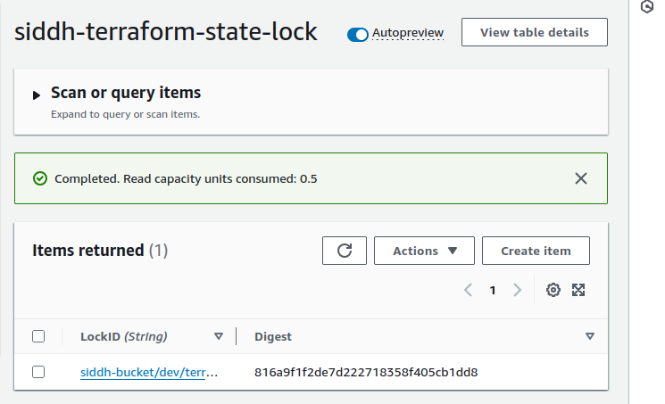
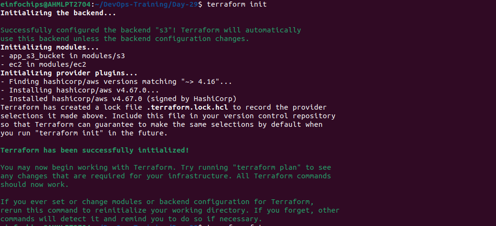
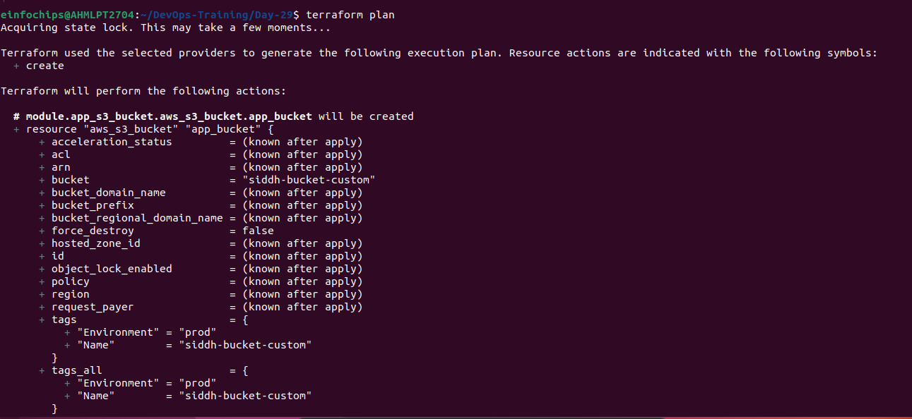
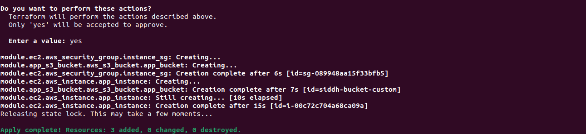
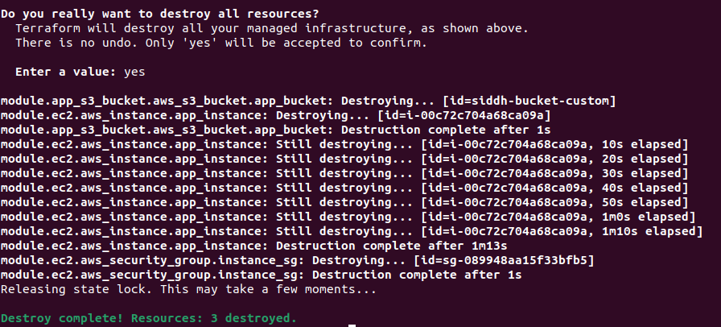

# Project: Advanced Terraform with Modules, Functions, State Locks, Remote State Management, and Variable Configuration

### 1)Remote State Management
#### S3 Bucket for State
```
aws s3 mb s3://siddh-bucket --region us-east-2
```
- configure.tf
```
terraform {
  backend "s3" {
    bucket         = "siddh-bucket"
    key            = "dev/terraform.tfstate"
    region         = "us-east-2"
    encrypt        = true
    dynamodb_table = "siddh-terraform-state-lock"
  }
}
```
#### State Locking with DynamoDB
```
aws dynamodb create-table \
    --table-name siddh-terraform-state-lock \
    --attribute-definitions AttributeName=LockID,AttributeType=S \
    --key-schema AttributeName=LockID,KeyType=HASH \
    --provisioned-throughput ReadCapacityUnits=5,WriteCapacityUnits=5 \
    --region us-east-2
```

### 2) Terraform Module Creation
#### Custom Module
##### EC2 Instance:
- modules/ec2/main.tf
```
resource "aws_security_group" "instance_sg" {
  name_prefix = "ec2-ssh-sg-"
  
  description = "Security group for SSH access"

  ingress {
    description = "Allow SSH"
    from_port   = 22
    to_port     = 22
    protocol    = "tcp"
    cidr_blocks = ["0.0.0.0/0"] # Allow from anywhere; modify this for better security
  }

  egress {
    from_port   = 0
    to_port     = 0
    protocol    = "-1"
    cidr_blocks = ["0.0.0.0/0"]
  }
  
  tags = {
    Name = "Siddh-SG-EC2 SSH Access"
  }
}

resource "aws_instance" "app_instance" {
  ami                         = var.ami
  instance_type               = var.instance_type
  vpc_security_group_ids      = [aws_security_group.instance_sg.id]
  tags = {
    Name = join("-", ["instance", var.name])
  }
}

output "instance_id" {
  value = aws_instance.app_instance.id
}
output "sg_id" {
  value = aws_security_group.instance_sg.id
}
```
- modules/ec2/variables.tf
```
variable "ami" {
  type        = string
  description = "The AMI ID to use for the instance"
}

variable "instance_type" {
  type        = string
  description = "The instance type for the EC2 instance"
}

variable "name" {
  type        = string
  description = "The name of the EC2 instance"
}

variable "region" {
  type        = string
  description = "The region of the EC2 instance"
}
```
- modules/ec2/terraform.tfvars
```
instance_type = "t2.micro"
ami        = "ami-000a81e3bab21747d"
name     = "siddh-ec2"
```
##### S3 Bucket:
- modules/s3/main.tf
```
resource "aws_s3_bucket" "app_bucket" {
  bucket = var.bucket_name

  tags = {
    Name        = var.bucket_name
    Environment = var.environment
  }
}
```
- modules/s3/variables.tf
```
variable "bucket_name" {
  description = "The name of the S3 bucket"
  type        = string
}
variable "environment" {
  description = "Environment for which this bucket is created (e.g., dev, prod)"
  type        = string
}
```

### 3) Output Configuration:
- modules/ec2/outputs.tf
```
output "ec2_public_ip" {
  description = "Public IP of the EC2 instance"
  value       = aws_instance.app_instance.public_ip
}

output "region" {
  description = "AWS region"
  value       = var.region
}
```
- modules/s3/outputs.tf
```
output "bucket_id" {
  description = "The ID of the S3 bucket"
  value       = aws_s3_bucket.app_bucket.id
}

output "bucket_arn" {
  description = "The ARN of the S3 bucket"
  value       = aws_s3_bucket.app_bucket.arn
}

output "bucket_region" {
  description = "The AWS region where the S3 bucket is created"
  value       = aws_s3_bucket.app_bucket.region
}
```
### 4) Testing State: Apply and Modify Infrastructure
```
terraform init
```


```
terraform plan
```


```
terraform apply
```

### 5) Resource Termination
```
terraform destroy
```

