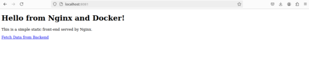

**Git Stash**

#### 

### **Docker Project 01**
#### **Project Overview**
### **Part 1: Creating a Container from a Pulled Image**

### **Part 2: Modifying the Container and Creating a New Image**
**Objective:** Modify the running Nginx container to serve a custom HTML page and create a new image from this modified container.

**Steps:**

### 
### **Part 3: Creating a Dockerfile to Build and Deploy a Web Application**
**Objective:** Write a Dockerfile to create an image for a simple web application and run it as a container.

**Steps:**

****
###
### 
### **Part 4: Cleaning Up**
**Objective:** Remove all created containers and images to clean up your environment.

**Steps:**

**Docker Project 02**
#### **Project Overview**
In this advanced project, you'll build a full-stack application using Docker. The application will consist of a front-end web server (Nginx), a back-end application server (Node.js with Express), and a PostgreSQL database. You will also set up a persistent volume for the database and handle inter-container communication. This project will take more time and involve more detailed steps to ensure thorough understanding.
### **Part 1: Setting Up the Project Structure**
**Objective:** Create a structured project directory with necessary configuration files.

### **Part 2: Setting Up the Database**
**Objective:** Set up a PostgreSQL database with Docker.

### **Part 4: Setting Up the Frontend (Nginx)**
**Objective:** Create a simple static front-end and set it up with Docker.

**Part 5: Connecting the Backend and Database**

**Objective:** Ensure the backend can communicate with the database and handle data requests.

### **Part 6: Final Integration and Testing**
**Objective:** Ensure all components are working together and verify the full-stack application.

**Part 7: Cleaning Up**

**Objective:** Remove all created containers, images, networks, and volumes to clean up your environment.

