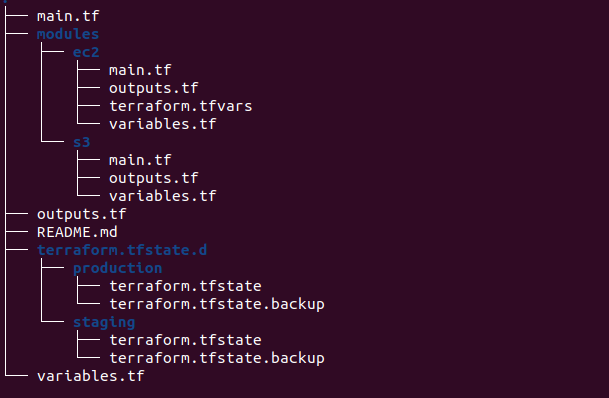
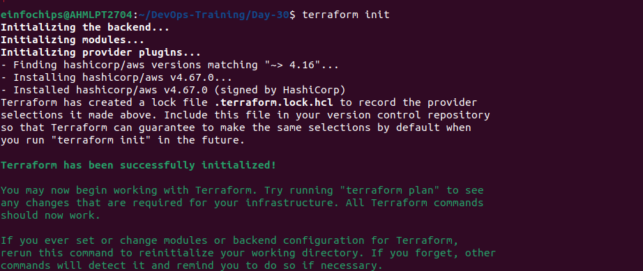
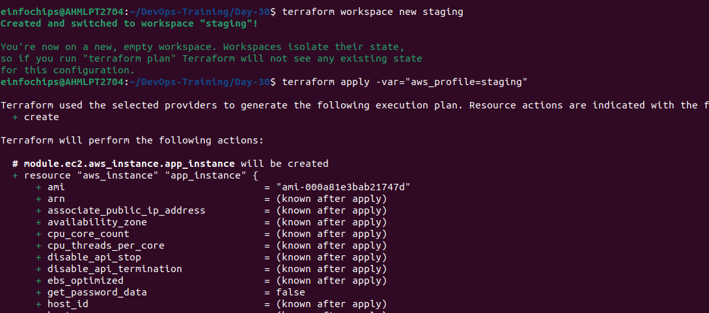
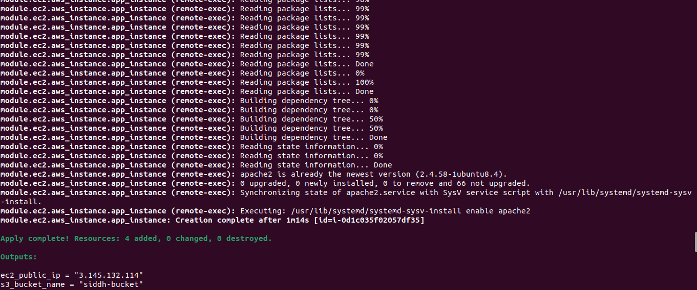
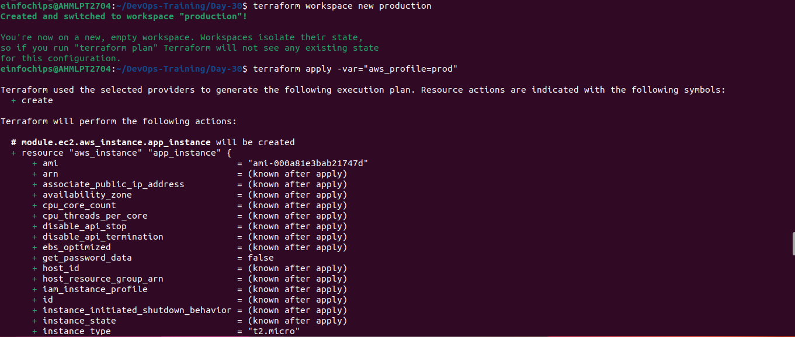
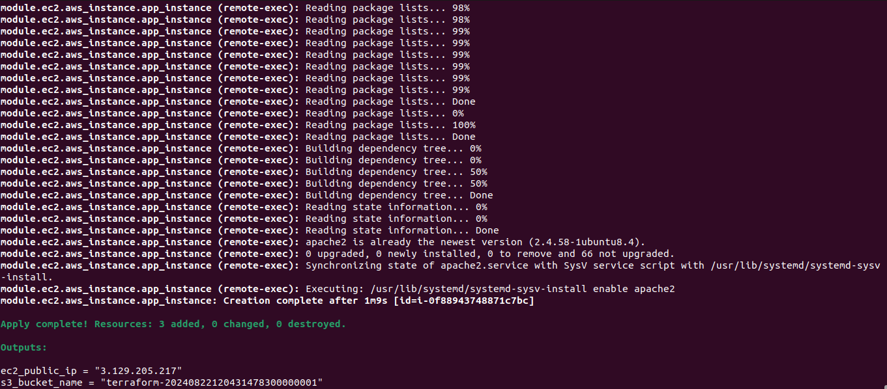
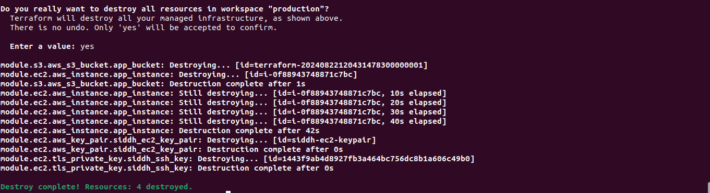

# Project: Advanced Terraform with Provisioners, Modules, and Workspaces
### Objective:
This project is designed to evaluate participants' understanding of Terraform provisioners, modules, and workspaces. The project involves deploying a basic infrastructure on AWS using Terraform modules, executing remote commands on the provisioned resources using provisioners, and managing multiple environments using Terraform workspaces. All resources should be within the AWS Free Tier limits.
### 1) Module Development
- modules/ec2/main.tf
```
resource "tls_private_key" "siddh_ssh_key" {
  algorithm = "RSA"
  rsa_bits  = 4096
}

resource "aws_key_pair" "siddh_ec2_key_pair" {
  key_name   = "siddh-ec2-keypair" 
  public_key = tls_private_key.siddh_ssh_key.public_key_openssh
}

resource "aws_instance" "app_instance" {
  ami                         = var.ami
  instance_type               = var.instance_type
  key_name                    = aws_key_pair.siddh_ec2_key_pair.key_name
  tags = {
    Name = "${terraform.workspace}-siddh-ec2"
  }
  connection {
    type        = "ssh"
    user        = "ubuntu"
    private_key = tls_private_key.siddh_ssh_key.private_key_pem
    host        = self.public_ip
  }

  provisioner "remote-exec" {
    inline = [
      "sudo apt-get update -y",                      
      "sudo apt-get install -y apache2",             
      "sudo systemctl start apache2",                
      "sudo systemctl enable apache2"
    ]
  }

}
```
- modules/ec2/outputs.tf
```
output "ec2_public_ip" {
  description = "Public IP of the EC2 instance"
  value       = aws_instance.app_instance.public_ip
}
```
- modules/ec2/variables.tf
```
variable "ami" {
  type        = string
  description = "The AMI ID to use for the instance"
}

variable "instance_type" {
  type        = string
  description = "The instance type for the EC2 instance"
}

variable "name" {
  type        = string
  description = "The name of the EC2 instance"
}
```
- modules/ec2/terraform.tfvars
```
instance_type = "t2.micro"
ami        = "ami-000a81e3bab21747d"
name     = "siddh-ec2"
```

- modules/s3/main.tf
```
resource "aws_s3_bucket" "app_bucket" {

  tags = {
    Name = "${terraform.workspace}-siddh-ec2"
  }

  provisioner "local-exec" {
  command = "echo 'S3 Bucket Created Successfully!'"
}

}
```
- modules/s3/outputs.tf
```
output "bucket_name" {
  description = "The ID of the S3 bucket"
  value       = aws_s3_bucket.app_bucket.id
}
```
- modules/s3/variables.tf
```
variable "bucket_name" {
  description = "The name of the S3 bucket"
  type        = string
}
```


### 2) Main Terraform Configuration
- main.tf
```
terraform {
  required_providers {
    aws = {
      source  = "hashicorp/aws"
      version = "~> 4.16"
    }
  }

  required_version = ">= 1.2.0"
}

provider "aws" {
  region  = "us-east-2"
  profile = var.aws_profile

}

module "ec2" {
  source        = "./modules/ec2"
  ami           = "ami-000a81e3bab21747d"
  instance_type = "t2.micro"
  name          = "siddh-ec2"
}
module "s3" {
  source      = "./modules/s3"
  bucket_name = "siddh-bucket"
}
```
### 3) Provisioner Implementation
- Remote Execution
```
connection {
    type        = "ssh"
    user        = "ubuntu"
    private_key = tls_private_key.siddh_ssh_key.private_key_pem
    host        = self.public_ip
  }

  provisioner "remote-exec" {
    inline = [
      "sudo apt-get update -y",                      
      "sudo apt-get install -y apache2",             
      "sudo systemctl start apache2",                
      "sudo systemctl enable apache2"
    ]
  }
```
- Local Execution
```
provisioner "local-exec" {
  command = "echo 'S3 Bucket Created Successfully!'"
}
```

### 4) Workspace Management
- Workspace creation
```
terraform workspace new staging
terraform workspace new production
```
- Changing Workspace
```
terraform workspace select staging
terraform workspace select production
```

### 5) Validation and Testing
```
terraform init
```

```
terraform apply -var="aws_profile=staging"
```


```
terraform apply -var="aws_profile=prod"
```



### 6) Resource Cleanup
```
terraform destroy
```

