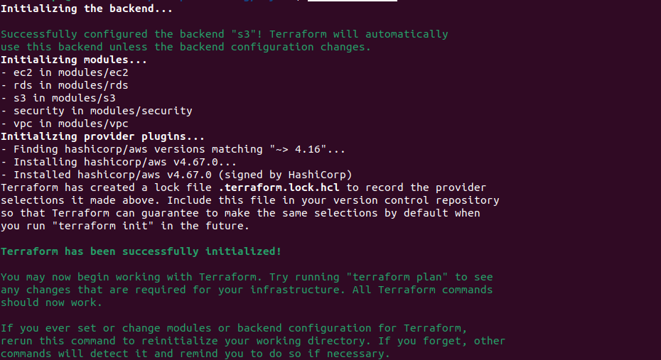
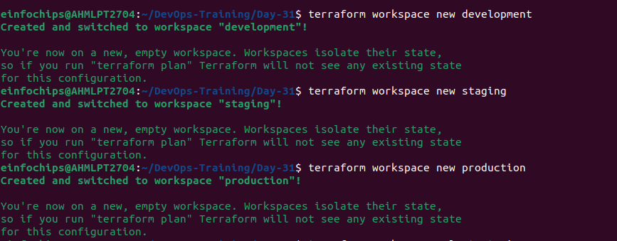
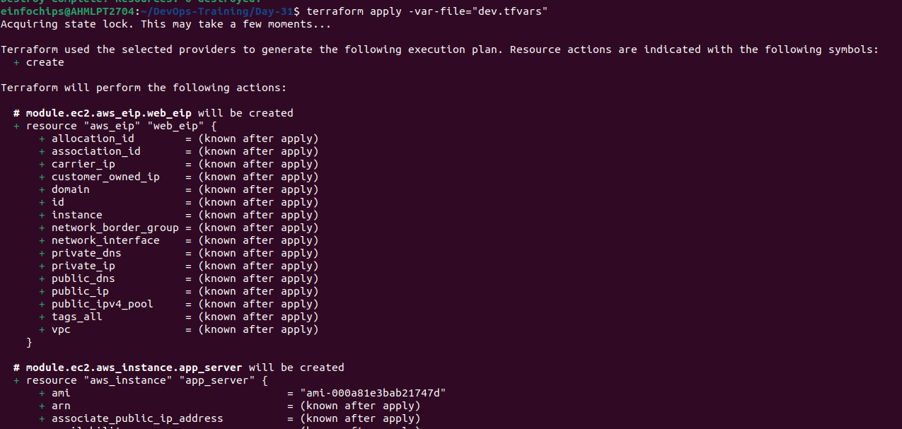
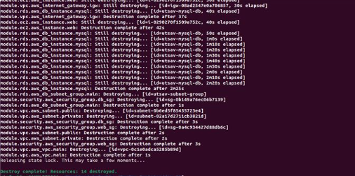

# Automation (IaaC) Terraform on AWS Assessment Project

### Project Overview
#### This capstone project is designed to assess participants' knowledge and practical skills with Terraform, specifically focusing on AWS. The project will require deploying a complete infrastructure using Terraform, emphasizing the usage of state lock, variables, .tfvars files, modules, functions, workspaces, and lifecycle rules. The deployment will be restricted to AWS Free Tier resources to avoid unnecessary costs.

### 1) Infrastructure Design
- 1) VPC
    - modules/vpc/main.tf
    ```
    provider "aws" {
  region = "us-west-2"
    }

    resource "aws_vpc" "main" {
    cidr_block = "10.0.0.0/16"
    enable_dns_support = true
    enable_dns_hostnames = true
    tags = {
        Name = "siddh-vpc"
    }
    }
    resource "aws_internet_gateway" "igw" {
    vpc_id = aws_vpc.main.id
    tags = {
        Name = "siddh-igw"
    }
    }

    resource "aws_subnet" "public" {
    vpc_id                  = aws_vpc.main.id
    cidr_block              = "10.0.1.0/24"
    availability_zone       = "us-west-2a"
    map_public_ip_on_launch = true
    tags = {
        Name = "siddh-public-subnet"
    }
    }

    resource "aws_subnet" "private" {
    vpc_id            = aws_vpc.main.id
    cidr_block        = "10.0.2.0/24"
    availability_zone = "us-west-2b"
    tags = {
        Name = "siddh-private-subnet"
    }
    }

    resource "aws_route_table" "public" {
    vpc_id = aws_vpc.main.id

    route {
        cidr_block = "0.0.0.0/0"
        gateway_id = aws_internet_gateway.igw.id
    }
    tags = {
        Name = "siddh-public-rt"
    }
    }

    resource "aws_route_table_association" "public" {
    subnet_id      = aws_subnet.public.id
    route_table_id = aws_route_table.public.id
    }
    ```
    - modules/vpc/variables.tf
    ```
    variable "vpc_cidr" {
  type        = string
  default     = "10.0.0.0/16"
  description = "CIDR block for the VPC"
    }
    ```
    - modules/vpc/outputs.tf
    ```
    output "vpc_id" {
  value = aws_vpc.main.id
    }

    output "public_subnet_id" {
    value = aws_subnet.public.id
    }

    output "private_subnet_id" {
    value = aws_subnet.private.id
    }

    ```
- 2) Security Groups:
    - modules/security/main.tf
    ```
    resource "aws_security_group" "ec2_sg" {
  vpc_id = var.vpc_id

  ingress {
    from_port   = 22
    to_port     = 22
    protocol    = "tcp"
    cidr_blocks = ["0.0.0.0/0"]
  }

  ingress {
    from_port   = 80
    to_port     = 80
    protocol    = "tcp"
    cidr_blocks = ["0.0.0.0/0"]
  }

  egress {
    from_port   = 0
    to_port     = 0
    protocol    = "-1"
    cidr_blocks = ["0.0.0.0/0"]
  }

  tags = {
    Name = "siddh-ec2_sg"
  }
    }

    resource "aws_security_group" "rds_sg" {
    vpc_id = var.vpc_id

    ingress {
        from_port   = 3306
        to_port     = 3306
        protocol    = "tcp"
        security_groups = [aws_security_group.ec2_sg.id]
    }

    egress {
        from_port   = 0
        to_port     = 0
        protocol    = "-1"
        cidr_blocks = ["0.0.0.0/0"]
    }

    tags = {
        Name = "siddh-rds_sg"
    }
    }
    ```
    - modules/security/variables.tf
    ```
    variable "vpc_id" {
  description = "ID of the VPC"
  type        = string
    }
    ```
    - modules/security/outputs.tf
    ```
    output "ec2_sg_id"{
    value= aws_security_group.ec2_sg.id
    }
    output "rds_sg_id"{
        value= aws_security_group.rds_sg.id
    }
    ```
- 3) EC2 Instances
    - modules/ec2/main.tf
    ```
    resource "aws_instance" "app_server" {  
  ami           = var.ami_id
  instance_type = var.instance_type
  subnet_id     = var.public_subnet_id
  security_groups = [var.web_sg_id]
  tags = {
    Name = "Siddh-Web-Instance"
  }
    }

    resource "aws_eip" "web_eip" {
    instance   = aws_instance.app_server.id
    }
    ```
    - modules/ec2/variables.tf
    ```
    variable "ami_id" {
  description = "AMI ID for the EC2 instances"
  type        = string
    }

    variable "instance_type" {
    description = "Instance type for the EC2 instances"
    type        = string
    default     = "t2.micro"
    }

    variable "public_subnet_id" {
    description = "Public subnet IDs"
    type        = string
    }

    variable "web_sg_id" {
    description = "Security group ID for the web server"
    type        = string
    }
    ```
    - modules/ec2/outputs.tf
    ```
    output "ec2_id"{
    value= aws_instance.app_server.id
    }
    ```
- 4) RDS Instance
    -  modules/rds/main.tf
    ```
    resource "aws_db_instance" "mysql" {
  identifier           = "siddh-mydb"
  engine               = "mysql"
  instance_class       = "db.t3.micro"
  db_name              = var.db_name
  username             = var.db_username
  password             = var.db_password
  allocated_storage = 20
  publicly_accessible  = false
  vpc_security_group_ids = [var.db_sg_id]
  db_subnet_group_name = aws_db_subnet_group.siddh-main.name
  skip_final_snapshot  = false
  final_snapshot_identifier = "i-skip-snapshot"

  tags = {
    Name= "Siddh-db"
  }
  
  lifecycle {
    prevent_destroy = true
  }
    }

    resource "aws_db_subnet_group" "siddh-main" {
    name        = "siddh-main"
    subnet_ids   = var.private_subnet_ids  
    tags = {
        Name = "siddh-main_db_subnet_group"
    }
    }
    ```
    - modules/rds/variables.tf
    ```
    variable "private_subnet_ids" {
  description = "Private subnet IDs"
  type        = list(string)
    }

    variable "db_name" {
    description = "Database name"
    type        = string
    }

    variable "db_username" {
    description = "Database username"
    type        = string
    }

    variable "db_password" {
    description = "Database password"
    type        = string
    sensitive   = true
    }

    variable "db_sg_id" {
    description = "Security group ID for the database"
    type        = string
    }

    ```
    - modules/rds/outputs.tf
    ```
    output "rds_id"{
    value=aws_db_instance.mysql.id
    }
    ```
- 5) S3 Bucket
    - modules/s3/main.tf
    ```
    resource "aws_s3_bucket" "app_bucket" {
  bucket = "siddh-bucket"
  tags = {
    Name  = "siddh-bucket"
  }
  
  lifecycle {
    ignore_changes = [tags]
  }
    }
    resource "aws_s3_bucket_versioning" "main" {
    bucket = aws_s3_bucket.app_bucket.id

    versioning_configuration {
        status = "Enabled"
    }
    }
    ```
    - modules/s3/variables.tf
    ```
    variable "bucket_name" {
  description = "The name of the S3 bucket"
  type        = string
    }
    ```
    - modules/s3/outputs.tf
    ```
    output "s3_b_name"{
    value= aws_s3_bucket.app_bucket.id
    }
    ```
- main.tf
```
terraform {
  required_providers {
    aws = {
      source  = "hashicorp/aws"
      version = "~> 4.16"
    }
  }

  required_version = ">= 1.2.0"
}

provider "aws" {
  region = "us-west-2"
}

module "vpc" {
  source   = "./modules/vpc"
  vpc_cidr = "10.0.0.0/16"
}

module "security" {
  source = "./modules/security"
  vpc_id = module.vpc.vpc_id
}

module "ec2" {
  source           = "./modules/ec2"
  ami_id           = "ami-08c40ec9ead489470"
  instance_type    = "t2.micro"
  public_subnet_id = module.vpc.public_subnet_id
  web_sg_id        = module.security.ec2_sg_id
}

module "rds" {
  source             = "./modules/rds"
  private_subnet_ids = [module.vpc.public_subnet_id, module.vpc.private_subnet_id]
  db_name            = "mydatabase"
  db_username        = "admin"
  db_password        = "password"
  db_sg_id           = module.security.rds_sg_id
}

module "s3" {
  source      = "./modules/s3"
  bucket_name = "my-app-bucket"
}
```
- variables.tf
```
variable "ami_id" {
  description = "AMI ID for the EC2 instances"
  type        = string
}

variable "instance_type" {
  description = "Instance type for the EC2 instances"
  type        = string
  default     = "t2.micro"
}
```
- outputs.tf
```
output "vpc_id" {
  value = module.vpc.vpc_id
}

output "public_subnet_id" {
  value = module.vpc.public_subnet_id
}

output "private_subnet_id" {
  value = module.vpc.private_subnet_id
}

output "web_ec2_ids" {
  value = module.ec2.ec2_id
}

output "db_instance_id" {
  value = module.rds.rds_id
}

output "s3_bucket_name" {
  value = module.s3.s3_b_name
}
```
### 2) Terraform State Management
- Create Bucket for storing state file
```
aws s3 mb s3://siddh-state-bucket-lock --region us-east-2
```
- Create DynamoDB table to store LockID
```
aws dynamodb create-table \
    --table-name siddh-terraform-state-lock \
    --attribute-definitions AttributeName=LockID,AttributeType=S \
    --key-schema AttributeName=LockID,KeyType=HASH \
    --provisioned-throughput ReadCapacityUnits=5,WriteCapacityUnits=5 \
    --region us-east-2
```
- backend.tf
```
terraform {
  backend "s3" {
    bucket         = "siddh-state-bucket-lock"
    key            = "dev/terraform.tfstate"
    region         = "us-east-2"
    encrypt        = true
    dynamodb_table = "siddh-terraform-state-lock"
  }
}
```
### 3) Variables and tfvars
- dev.tfvars
```
ami_id        = "ami-08c40ec9ead489470"
instance_type = "t2.micro"
```
- prod.tfvars
```
ami_id        = "ami-1234567899"
instance_type = "t2.medium"
```
### 4) Workspace
- Create 3 workspaces: Development, Staging, Production
```
terraform init
```

```
terraform workspace new development
terraform workspace new staging
terraform workspace new production
```


### 5) Lifecycle Rules
- prevent_destroy
```
lifecycle {
    prevent_destroy = true
  }
```
- ignore_changes
```
lifecycle {
    ignore_changes = [tags]
  }
```

### 6) Apply all
```
terraform apply -var-file="dev.tfvars"
terraform apply -var-file="prod.tfvars"
```


```
terraform destroy
```
