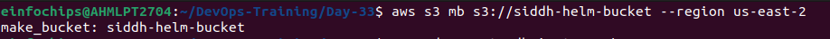
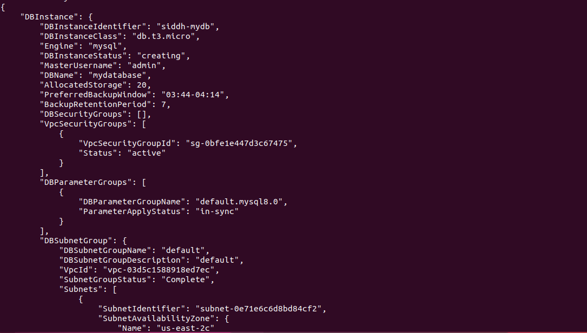
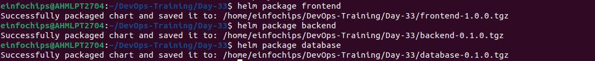
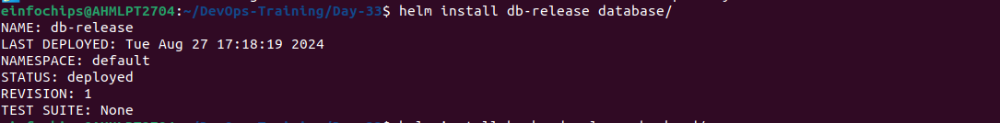
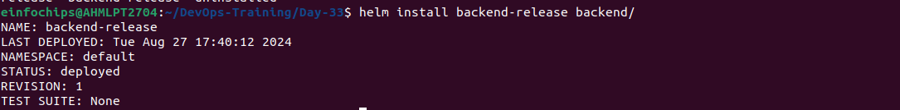
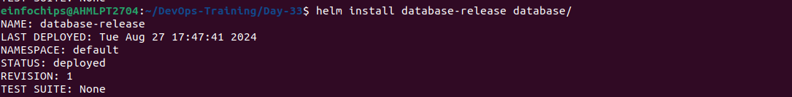
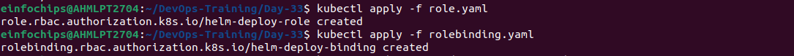
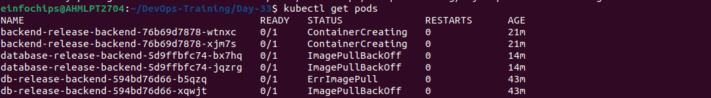
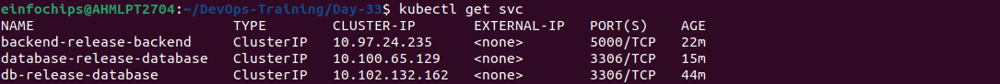
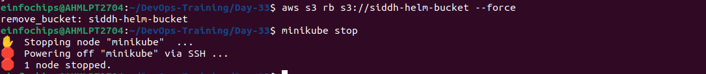

# Deploying a Multi-Tier Application Using Helm on Kubernetes and AWS Free Tier Services
### Project Objectives:

#### - Deploy a multi-tier application using Helm on Minikube.
#### - Integrate AWS free-tier services (S3 and RDS).
#### - Manage Helm charts, including versioning, packaging, and rollbacks.
#### - Implement Helm secrets management and RBAC.
#### - Handle dependencies between different components of the application.

### 1) Setup Helm and Minikube
- Minikube is running or not
```
minikube start
```
- Install Helm
```
curl https://baltocdn.com/helm/signing.asc | gpg --dearmor | sudo tee /usr/share/keyrings/helm.gpg > /dev/null
sudo apt-get install apt-transport-https --yes
echo "deb [arch=$(dpkg --print-architecture) signed-by=/usr/share/keyrings/helm.gpg] https://baltocdn.com/helm/stable/debian/ all main" | sudo tee /etc/apt/sources.list.d/helm-stable-debian.list
sudo apt-get update
sudo apt-get install helm
```
### 2) AWS Services Setup

- S3 Bucket: Create an S3 bucket for storing application assets (e.g., static files for the frontend).
```
aws s3 mb s3://siddh-helm-bucket --region us-east-2
```

- RDS Instance: Set up an Amazon RDS MySQL instance in the free tier.

```
aws rds create-db-instance \
  --db-instance-identifier siddh-mydb \
  --allocated-storage 20 \
  --db-instance-class db.t3.micro \
  --engine mysql \
  --master-username admin \
  --master-user-password password \
  --backup-retention-period 7 \
  --no-multi-az \
  --publicly-accessible \
  --storage-type gp2 \
  --db-name mydatabase
```


### 3) Create Helm Charts
#### - Frontend Chart: Create a Helm chart for a frontend service (e.g., NGINX) that pulls static files from the S3 bucket.

```
helm create frontend
```
- frontend/values.yaml
```
image:
  repository: nginx
  tag: stable
  pullPolicy: IfNotPresent

service:
  type: ClusterIP
  port: 80

s3BucketName: siddh-helm-bucket
```
- frontend/templates/deployment.yaml
```
initContainers:
- name: download-s3-content
  image: amazon/aws-cli
  command: ["/bin/sh", "-c"]
  args: ["aws s3 sync s3://{{ .Values.s3BucketName }} /usr/share/nginx/html"]
  env:
  - name: AWS_ACCESS_KEY_ID
    valueFrom:
      secretKeyRef:
        name: s3-secrets
        key: accessKey
  - name: AWS_SECRET_ACCESS_KEY
    valueFrom:
      secretKeyRef:
        name: s3-secrets
        key: secretKey
```
- frontend/templates/service.yaml
```
apiVersion: v1
kind: Service
metadata:
  name: "frontend-service"
  labels:
    frontend-service
spec:
  type: {{ .Values.service.type }}
  ports:
    - port: {{ .Values.service.port }}
      targetPort: http
      protocol: TCP
      name: http
```
#### - Backend Chart: Create a Helm chart for a backend service (e.g., a Python Flask API) that connects to the RDS MySQL database.
```
helm create backend
```
- backend/values.yaml
```
image:
  repository: "siddhpatel/flask-api"
  tag: "latest"
env:
  dbMaxConnections: "100"
  dbConnectionTimeout: "30s"
secrets:
  db_host: "siddh-mydb.us-east-2.rds.amazonaws.com"
  db_user: "admin"
  db_password: "password"
  db_name: "mydatabase"
```
- backend/templates/deployment.yaml
```
apiVersion: apps/v1
kind: Deployment
metadata:
  name: {{ .Release.Name }}-backend
  labels:
    app: {{ .Release.Name }}-backend
spec:
  replicas: 2
  selector:
    matchLabels:
      app: {{ .Release.Name }}-backend
  template:
    metadata:
      labels:
        app: {{ .Release.Name }}-backend
    spec:
      containers:
      - name: flask-api
        image: {{ .Values.image.repository }}:{{ .Values.image.tag }}
        ports:
        - containerPort: 5000
        env:
        - name: DB_HOST
          valueFrom:
            secretKeyRef:
              name: {{ .Release.Name }}-db-secret
              key: db_host
        - name: DB_USER
          valueFrom:
            secretKeyRef:
              name: {{ .Release.Name }}-db-secret
              key: db_user
        - name: DB_PASSWORD
          valueFrom:
            secretKeyRef:
              name: {{ .Release.Name }}-db-secret
              key: db_password
        - name: DB_NAME
          valueFrom:
            secretKeyRef:
              name: {{ .Release.Name }}-db-secret
              key: db_name
        - name: DB_MAX_CONNECTIONS
          value: "{{ .Values.env.dbMaxConnections }}"   # Quoted
        - name: DB_CONNECTION_TIMEOUT
          value: "{{ .Values.env.dbConnectionTimeout }}" # Quoted
        volumeMounts:
        - name: config-volume
          mountPath: /etc/config
      volumes:
      - name: config-volume
        configMap:
          name: {{ .Release.Name }}-config
```
- backend/templates/service.yaml
```
apiVersion: v1
kind: Service
metadata:
  name: {{ .Release.Name }}-backend
spec:
  type: ClusterIP
  ports:
  - port: 5000
    targetPort: 5000
  selector:
    app: {{ .Release.Name }}-backend
```
- backend/app.py
```
from flask import Flask, jsonify

app = Flask(__name__)

@app.route('/')
def home():
    return jsonify(message="Hello from Flask API!")

if __name__ == '__main__':
    app.run(host='0.0.0.0', port=5000)
```
- backend/Dockerfile
```
# Use the official Python image from the Docker Hub
FROM python:3.9-slim

# Set the working directory in the container
WORKDIR /app

# Copy the requirements file into the container
COPY requirements.txt requirements.txt

# Install the dependencies
RUN pip install -r requirements.txt

# Copy the rest of the application into the container
COPY . .

# Specify the command to run on container start
CMD ["python", "app.py"]

# Expose the port that the app runs on
EXPOSE 5000
```
- backend/requirements.txt
```
Flask==2.1.0
```
#### - Database Chart: Include configurations for connecting to the RDS MySQL instance in the backend chart.
```
helm create database
```
- database/values.yaml
```
database:
  host: siddh-mydb.us-east-2.rds.amazonaws.com
  user: admin
  password: password
  name: mydatabase
```
- database/templates/deployment.yaml
```
apiVersion: apps/v1
kind: Deployment
metadata:
  name: {{ .Release.Name }}-backend
  labels:
    app: {{ .Release.Name }}-backend
spec:
  replicas: 2
  selector:
    matchLabels:
      app: {{ .Release.Name }}-backend
  template:
    metadata:
      labels:
        app: {{ .Release.Name }}-backend
    spec:
      containers:
      - name: flask-api
        image: {{ .Values.image.repository }}:{{ .Values.image.tag }}
        ports:
        - containerPort: 5000
        env:
        - name: DB_HOST
          valueFrom:
            secretKeyRef:
              name: {{ .Release.Name }}-db-secret
              key: db_host
        - name: DB_USER
          valueFrom:
            secretKeyRef:
              name: db-secrets
              key: db_user
        - name: DB_PASSWORD
          valueFrom:
            secretKeyRef:
              name: db-secrets
              key: db_password
        - name: DB_NAME
          valueFrom:
            secretKeyRef:
              name: {{ .Release.Name }}-db-secret
              key: db_name
        - name: S3_ACCESS_KEY
          valueFrom:
            secretKeyRef:
              name: s3-secrets
              key: accessKey
        - name: S3_SECRET_KEY
          valueFrom:
            secretKeyRef:
              name: s3-secrets
              key: secretKey
        - name: DB_MAX_CONNECTIONS
          value: "{{ .Values.env.dbMaxConnections }}"   # Quoted
        - name: DB_CONNECTION_TIMEOUT
          value: "{{ .Values.env.dbConnectionTimeout }}" # Quoted
        volumeMounts:
        - name: config-volume
          mountPath: /etc/config
      volumes:
      - name: config-volume
        configMap:
          name: {{ .Release.Name }}-config
```
- database/templates/service.yaml
```
apiVersion: v1
kind: Service
metadata:
  name: {{ .Release.Name }}-database
  labels:
    app: {{ .Release.Name }}-database
spec:
  selector:
    app: {{ .Release.Name }}-database
  ports:
    - protocol: TCP
      port: 3306  # Default MySQL port
      targetPort: 3306
  type: ClusterIP
```
- database/templates/secrets.yaml
```
apiVersion: v1
kind: Secret
metadata:
  name: {{ .Release.Name }}-db-secret
type: Opaque
data:
  db_host: {{ .Values.database.host | b64enc | quote }}
  db_user: {{ .Values.database.user | b64enc | quote }}
  db_password: {{ .Values.database.password | b64enc | quote }}
  db_name: {{ .Values.database.name | b64enc | quote }}
```
- database/templates/configmap.yaml
```
apiVersion: v1
kind: ConfigMap
metadata:
  name: {{ .Release.Name }}-config
data:
  DB_MAX_CONNECTIONS: "100"
  DB_CONNECTION_TIMEOUT: "30"
```

### 4) Package Helm Charts
```
helm package frontend
helm package backend
helm package database
```

### 5) Deploy Multi-Tier Application Using Helm
- Deploy the database chart (connected to the RDS instance).
```
helm install db-release database/
```

- Deploy the backend chart with dependency on the database chart.

- Deploy the frontend chart with dependency on the backend service, ensuring it pulls assets from the S3 bucket.


### 6) Manage Helm Secrets
- secrets/db-secrets
```
kubectl create secret generic db-secrets \
  --from-literal=username=<your-username> \
  --from-literal=password=<your-password>
```
- secrets/s3-secrets
```
kubectl create secret generic s3-secrets \
  --from-literal=accessKey=<your-access-key> \
  --from-literal=secretKey=<your-secret-key>
```


### 7) Implement RBAC
- role.yaml
```
kind: Role
apiVersion: rbac.authorization.k8s.io/v1
metadata:
  namespace: default
  name: helm-deploy-role
rules:
- apiGroups: ["", "apps", "extensions"]
  resources: ["pods", "deployments", "services"]
  verbs: ["get", "list", "create", "delete"]
```
- RoleBindings.yaml
```
kind: RoleBinding
apiVersion: rbac.authorization.k8s.io/v1
metadata:
  name: helm-deploy-binding
  namespace: default
subjects:
- kind: User
  name: admin
  apiGroup: rbac.authorization.k8s.io
roleRef:
  kind: Role
  name: helm-deploy-role
  apiGroup: rbac.authorization.k8s.io
```

### 8) Versioning and Rollback
```
helm upgrade frontend-release frontend/
helm rollback frontend-release 1.0
```
### 9) Validate and Cleanup
- Validate
```
kubectl get pods
```

```
kubectl get svc
```

- Cleanup
```
helm delete frontend-release
helm delete backend-release
helm delete db-release
```
- Terminate AWS Instances
```
aws rds delete-db-instance --db-instance-identifier siddh-mydb --skip-final-snapshot
aws s3 rb s3://siddh-helm-bucket --force
```
- Stop minikube
```
minikube stop
```
