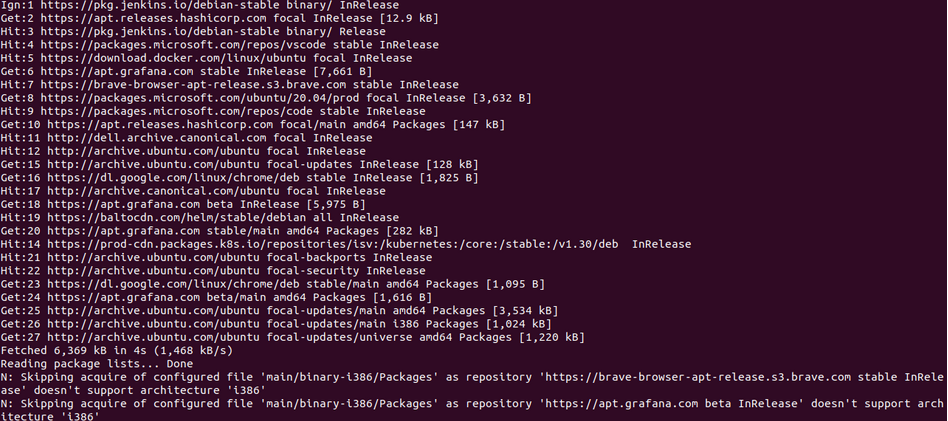
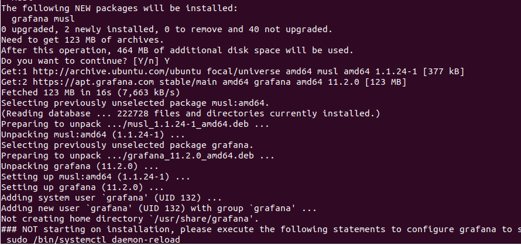
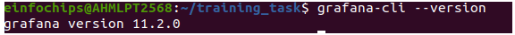
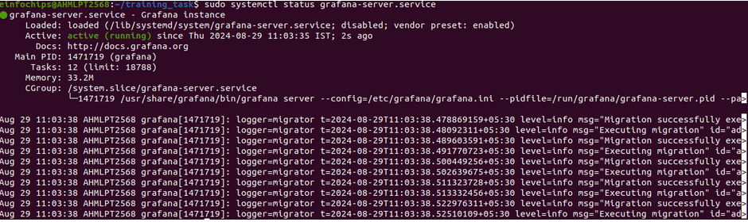
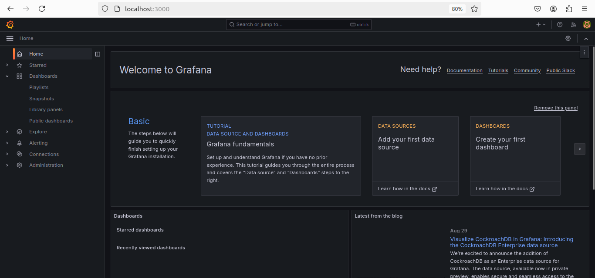
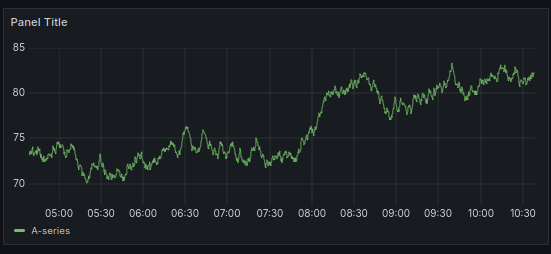
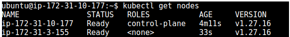

# TASK 1- Installation of Grafana

- Install the prerequisite packages:

```
sudo apt-get install -y apt-transport-https software-properties-common wget
```
- Import the GPG key:

```
sudo mkdir -p /etc/apt/keyrings/

wget -q -O - https://apt.grafana.com/gpg.key | gpg --dearmor | sudo tee /etc/apt/keyrings/grafana.gpg > /dev/null
```


- To add a repository for stable releases, run the following command:

```
echo "deb [signed-by=/etc/apt/keyrings/grafana.gpg] https://apt.grafana.com stable main" | sudo tee -a /etc/apt/sources.list.d/grafana.list
```

- Run the following command to update the list of available packages:

```
sudo apt-get update
```
- To install Grafana OSS, run the following command:

```
sudo apt-get install grafana
```


- To install Grafana Enterprise, run the following command:

```
sudo apt-get install grafana-enterprise
```

- Verify installation
```
grafana-cli --version
```



- Now once it get installed start the server using
```
sudo systemctl start grafana-server.service
```

- And Then verify using
```
sudo systemctl status grafana-server.service
```


- Then redirect to http://localhost:3000/login to see running grafana and login using admin credentials


- Create a Demo Dashboard


# Task 2 : Connection of worker node with master using kubeadm

## Kubernetes Cluster Setup

### 1) Install Packages on All Nodes

#### Configure & Install Containerd

1) Create Configuration file:

```
cat <<EOF | sudo tee /etc/modules-load.d/containerd.conf
overlay
br_netfilter
EOF
```
2) Load Modules:

```
sudo modprobe overlay
sudo modprobe br_netfilter
```

3) Set System Configurations:
```
cat <<EOF | sudo tee /etc/sysctl.d/99-kubernetes-cri.conf
net.bridge.bridge-nf-call-iptables = 1
net.ipv4.ip_forward = 1
net.bridge.bridge-nf-call-ip6tables = 1
EOF
sudo sysctl --system
```

4) Install containerd:
```
sudo apt-get update && sudo apt-get install -y containerd.io
```

5) Create and Generate Default Configuration:
```
sudo mkdir -p /etc/containerd
sudo containerd config default | sudo tee /etc/containerd/config.toml
sudo systemctl restart containerd
```

6) Verify containerd is Running:
```
sudo systemctl status containerd
```

7) Disable Swap:
```
sudo swapoff -a
```
8) Install Dependency Packages:
```
sudo apt-get update && sudo apt-get install -y apt-transport-https curl
```
9) Add Kubernetes GPG Key and Repository:

```
curl -fsSL https://pkgs.k8s.io/core:/stable:/v1.27/deb/Release.key | sudo gpg --dearmor -o /etc/apt/keyrings/kubernetes-apt-keyring.gpg
cat <<EOF | sudo tee /etc/apt/sources.list.d/kubernetes.list
deb [signed-by=/etc/apt/keyrings/kubernetes-apt-keyring.gpg] https://pkgs.k8s.io/core:/stable:/v1.27/deb/ /
EOF
sudo apt-get update
```

10) Install Kubernetes Packages:
```
sudo apt-get install -y kubelet kubeadm kubectl
sudo apt-mark hold kubelet kubeadm kubectl
```
### 2) Initialize the Cluster on the Control Plane Node

1) Initialize Kubernetes:
```
sudo kubeadm init --pod-network-cidr 192.168.0.0/16 --kubernetes-version 1.27.11
```
2) Set kubectl Access:
```
mkdir -p $HOME/.kube
sudo cp -i /etc/kubernetes/admin.conf $HOME/.kube/config
sudo chown $(id -u):$(id -g) $HOME/.kube/config
```

3) Test Access:
```
kubectl get nodes
```

### 3) Install the Calico Network Add-On

1) Apply Calico Manifest:
```
kubectl apply -f https://raw.githubusercontent.com/projectcalico/calico/v3.25.0/manifests/calico.yaml
```
2) Check Node Status:
```
kubectl get nodes
```
### 4) Join Worker Nodes to the Cluster

1) Create Join Command on Control Plane Node:
```
kubeadm token create --print-join-command
```
2) Run Join Command on Each Worker Node:
```
sudo kubeadm join <control-plane-endpoint>
```
3) Verify Cluster Status on Control Plane Node:
```
kubectl get nodes
```

