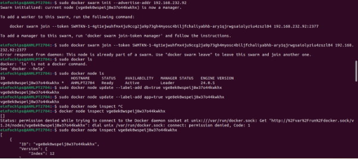

## **Project 01**
### **Objectives:**
- Create and manage Docker volumes for data persistence.
- Set up a Docker network for container communication.
- Use Docker Compose to manage multi-container applications.
- View and manage Docker logs.
- Deploy the application using Docker Swarm.
### **Project Outline:**
1. **Create Docker Volumes**
1. **Create a Docker Network**
1. **Write a Docker Compose File**
1. **Deploy the Application with Docker Compose**
1. **Manage Docker Logs**
1. **Deploy the Application Using Docker Swarm**
### **Step-by-Step Guide**

####
#### 

## **Project 02:** 
## **Objectives:**
- Deploy an application across multiple Docker Swarm worker nodes.
- Place specific components on designated nodes.
- Monitor and troubleshoot using Docker logs.
- Modify and redeploy the application.
### **Project Outline:**
1. **Initialize Docker Swarm and Join Worker Nodes**
1. **Label Nodes for Specific Component Placement**
1. **Create a Docker Stack File**
1. **Deploy the Application**
1. **Monitor and Troubleshoot Using Docker Logs**
1. **Modify and Redeploy the Application**
### **Step-by-Step Guide**
#### 

#### **3. Create a Docker Stack File**

