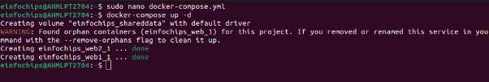

## **Project 01 - 1 Hour**
## **Deploying a Scalable Web Application with Persistent Storage and Advanced Automation**
### **Objective:**
Deploy a scalable web application using Docker Swarm and Kubernetes, ensuring data persistence using a single shared volume, and automate the process using advanced shell scripting.
### **Overview:**
1. **Step 1**: Set up Docker Swarm and create a service.
1. **Step 2**: Set up Kubernetes using Minikube.
1. **Step 3**: Deploy a web application using Docker Compose.
1. **Step 4**: Use a single shared volume across multiple containers.
1. **Step 5**: Automate the entire process using advanced shell scripting.

![ref1]
### **Step 1: Set up Docker Swarm and Create a Service**
#### 

### **Step 3: Deploy a Web Application Using Docker Compose**
#### **3.1 Create a docker-compose.yml File**

### **Step 4: Use a Single Shared Volume Across Multiple Containers**
#### 

### **Step 5: Automate the Entire Process Using Advanced Shell Scripting**
#### 
###
###
###

### **Project 02 - 1 Hour**
### **Comprehensive Deployment of a Multi-Tier Application with CI/CD Pipeline**
### **Objective:**
Deploy a multi-tier application (frontend, backend, and database) using Docker Swarm and Kubernetes, ensuring data persistence using a single shared volume across multiple containers, and automating the entire process using advanced shell scripting and CI/CD pipelines.
### **Overview:**
1. **Step 1**: Set up Docker Swarm and create a multi-tier service.
1. **Step 2**: Set up Kubernetes using Minikube.
1. **Step 3**: Deploy a multi-tier application using Docker Compose.
1. **Step 4**: Use a single shared volume across multiple containers.
1. **Step 5**: Automate the deployment process using advanced shell scripting.

![ref1]
### **Step 1: Set up Docker Swarm and Create a Multi-Tier Service**
#### 

### **Step 2: Set up Kubernetes Using Minikube**
#### 
### **Step 3: Deploy a Multi-Tier Application Using Docker Compose**
#### 
### **Step 4: Use a Single Shared Volume Across Multiple Containers**
Update docker-compose.yml as shown in Step 3.1 to use the shareddata volume across the frontend and backend services.
