###
### **Project 01**
### **Deploying a Node.js App Using Minikube Kubernetes**
#### **Overview**
This project guides you through deploying a Node.js application using Minikube Kubernetes. You'll use Git for version control, explore branching and fast-forward merges, and set up Kubernetes services and deployment pods, including ClusterIP and NodePort service types.
#### **Prerequisites**
- Minikube installed
- kubectl installed
- Git installed
- Node.js installed (<https://nodejs.org/en/download/package-manager/all#debian-and-ubuntu-based-linux-distributions>)
#### **Project Steps**
### **1. Set Up Git Version Control**
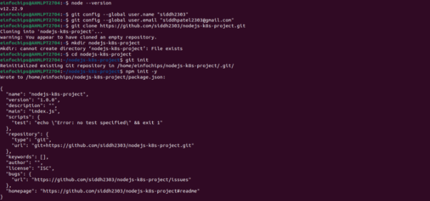
### 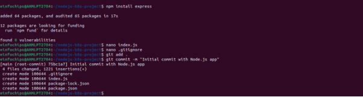
### **2. Branching and Fast-Forward Merge**
**2.1. Create a New Branch**

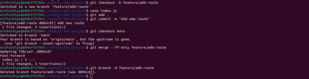
###
### **3. Containerize the Node.js Application**
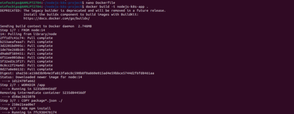
### 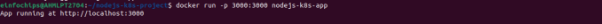
### **4. Deploying to Minikube Kubernetes**

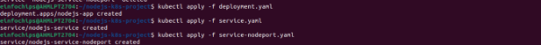

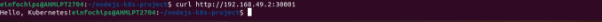
### **Making Changes to the App and Redeploying Using Kubernetes**
### **6. Making Changes to the Node.js Application**
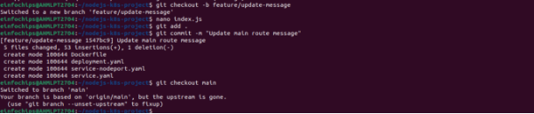
### **7. Merge the Changes and Rebuild the Docker Image**
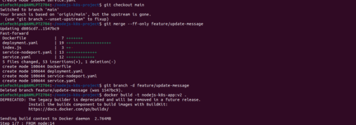
###

**Project 02** 
### **Deploying a Python Flask App Using Minikube Kubernetes**
#### **Overview**
This project guides you through deploying a Python Flask application using Minikube Kubernetes. You'll use Git for version control, explore branching and fast-forward merges, and set up Kubernetes services and deployment pods, including ClusterIP and NodePort service types.
#### **Prerequisites**
- Minikube installed
- kubectl installed
- Git installed
- Python installed
#### **Project Steps**
### **1. Set Up Git Version Control**
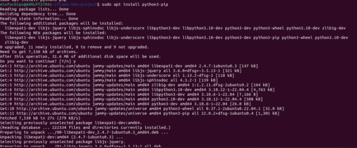
###

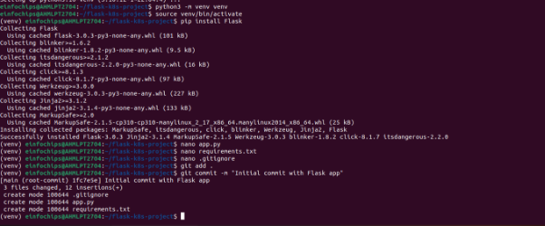
### **2. Branching and Fast-Forward Merge**
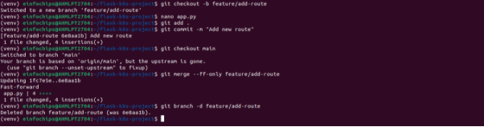

### **3. Containerize the Flask Application**

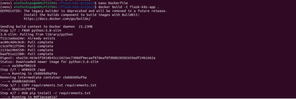

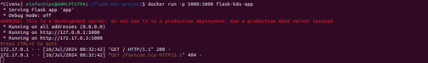

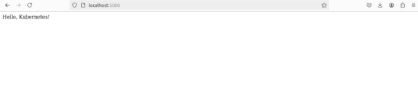
###
###
###
### **4. Deploying to Minikube Kubernetes**
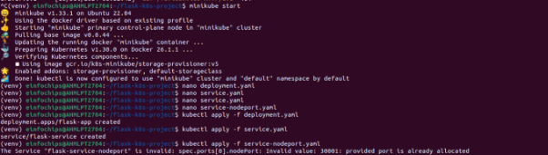

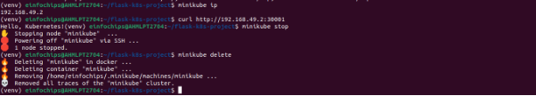
###
### **6. Making Changes to the Flask Application**
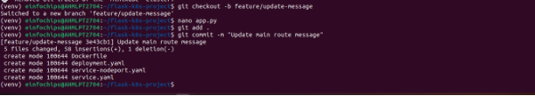

