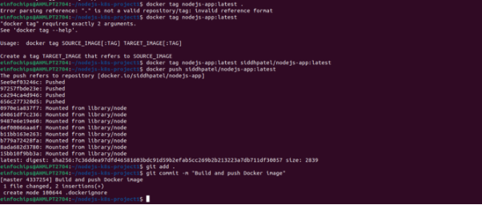

**Project 01**

In this project, you will develop a simple Node.js application, deploy it on a local Kubernetes cluster using Minikube, and configure various Kubernetes features. The project includes Git version control practices, creating and managing branches, and performing rebases. Additionally, you will work with ConfigMaps, Secrets, environment variables, and set up vertical and horizontal pod autoscaling.
## **Project Steps**
### **1. Setup Minikube and Git Repository**

### **2. Develop a Node.js Application**
#### 
### **3. Create Dockerfile and Docker Compose**
#### 
### **4. Build and Push Docker Image**
#### 
### 
### **5. Create Kubernetes Configurations**
#### 
### **6. Implement Autoscaling**
#### **6.1 Create Horizontal Pod Autoscaler**
**Create kubernetes/hpa.yaml**:

#### **6.2 Create Vertical Pod Autoscaler**
**Create kubernetes/vpa.yaml**:

apiVersion: autoscaling.k8s.io/v1beta2

kind: VerticalPodAutoscaler

metadata:

`  `name: nodejs-app-vpa

spec:

`  `targetRef:

`    `apiVersion: apps/v1

`    `kind: Deployment

`    `name: nodejs-app-deployment

`  `updatePolicy:

`    `updateMode: "Auto"

**Apply the VPA**:

kubectl apply -f kubernetes/vpa.yaml

### **7. Test the Deployment**
#### 
### **8. Git Version Control**
#### 
### 
### 
### **9. Final Commit and Cleanup**

**Project 02**

Deploy a Node.js application to Kubernetes with advanced usage of ConfigMaps and Secrets. Implement Horizontal Pod Autoscaler (HPA) with both scale-up and scale-down policies. The project will include a multi-environment configuration strategy, integrating a Redis cache, and monitoring application metrics.
## **Project Setup**
### **1.1 Initialize a Git Repository**

**2. Advanced Kubernetes Configuration**

