###
#### 
#### **Requirements and Deliverables**
### **Stage 1: Setting Up the Kubernetes Cluster and Static Web App**
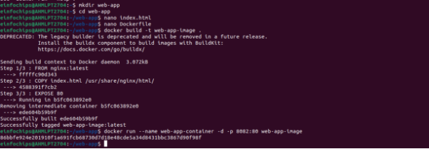Here I have create a folder named web-app. Inside this, there is index.html file and dockerfile for building docker image and deploying it on docker hub.

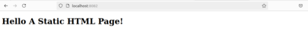This is sample output of that url.

**Kubernetes Deployment:**

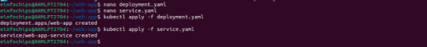This is deployment and service file which needs to be applied in kubernetes.
### **Stage 2: Configuring Ingress Networking**
4. **Install and Configure Ingress Controller:**

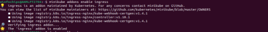This command enables ingress inside minikube.

4. **Create Ingress Resource:**

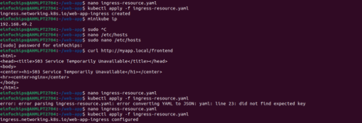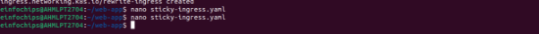Now to access the resources in ingress, we need to create ingress-resource.yaml file. Then by ‘minikube ip’ command we can get its IP, which needs to be given to hosts file, for executing our application on browser.

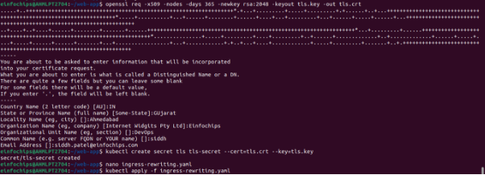For using TLS certificate, we need to download tls.ke and tls.crt files from url. 

Afterwards, by creating a secret this certificate gets bind to the minikube ip.

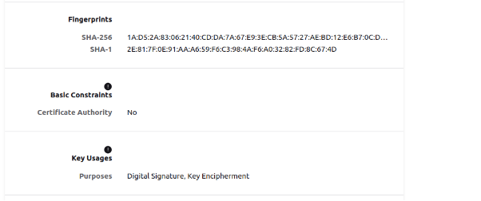

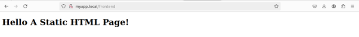

This is output of frontend page running index.html file which was previously created.
### **Stage 3: Implementing Horizontal Pod Autoscaling**
6. **Configure Horizontal Pod Autoscaler:**

   **hpa.yaml:**

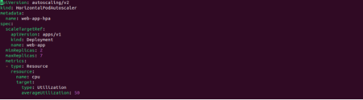

For autoscaling, HPA file is created in which minimum and maximum replicas threshold needs to be specified, also with the average cpu utilization.

6. **Stress Testing:**

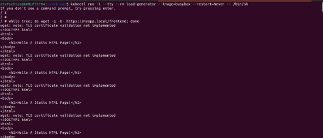

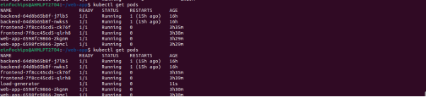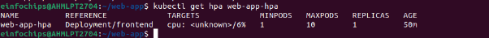

**kubectl run -i --tty --rm load-generator --image=busybox --restart=Never -- /bin/sh**

\# Inside the pod, run the following command to generate load

while true; do wget -q -O- http://myapp.local/frontend; done

This command is used for creating load on Pods so that whenever needed, extra replicas are created automatically.
### **Stage 4: Final Validation and Cleanup**
8. **Final Validation:**

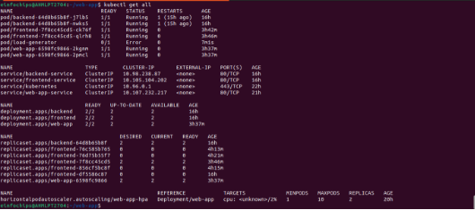

8. **Cleanup:**
   1. kubectl delete ingress web-app-ingress
   1. kubectl delete hpa web-app-hpa
   1. kubectl delete service web-app-service
   1. kubectl delete service web-app-service
   1. kubectl delete deployment siddhpatel/web-app
