# Project: Modular E-Commerce application deployment with S3 integration

### 1) Set Up AWS EC2 Instances
- Launch 3 EC2 Instances of t2.micro
- Configure Security groups to allow necessary ports
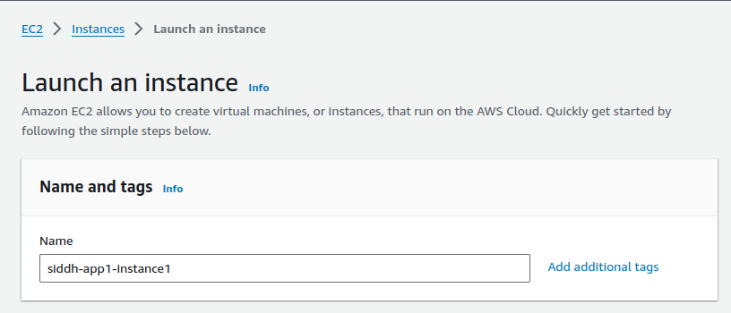

### 2) Create and Configure S3 Bucket
- Create an S3 bucket to store static assets
- Upload Static files to the S3 bucket.
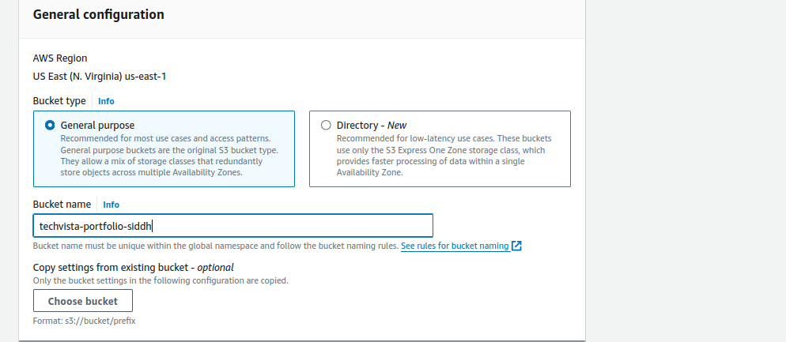
Configure Bucket policy to allow read access for the application.
```
{
    "Version": "2012-10-17",
    "Id": "Policy1723096508823",
    "Statement":[
        {
            "Sid": "Stimt1723896503431",
            "Effect: "Allow",
            "Principal: "*",
            "Action": "s3:GetObject",
            "Resource": "armaws:s3: siddh-static-content
        }
    ]
}
```

### 3) Set up Kubernetes Cluster
#### On Master Node:
- Install Kubeadm,Kubelet, Kubectl
- Set up a network plugin

#### Configure & Install Containerd

1) Create Configuration file:

```
cat <<EOF | sudo tee /etc/modules-load.d/containerd.conf
overlay
br_netfilter
EOF
```
2) Load Modules:

```
sudo modprobe overlay
sudo modprobe br_netfilter
```

3) Set System Configurations:
```
cat <<EOF | sudo tee /etc/sysctl.d/99-kubernetes-cri.conf
net.bridge.bridge-nf-call-iptables = 1
net.ipv4.ip_forward = 1
net.bridge.bridge-nf-call-ip6tables = 1
EOF
sudo sysctl --system
```

4) Install containerd:
```
sudo apt-get update && sudo apt-get install -y containerd.io
```

5) Create and Generate Default Configuration:
```
sudo mkdir -p /etc/containerd
sudo containerd config default | sudo tee /etc/containerd/config.toml
sudo systemctl restart containerd
```

6) Verify containerd is Running:
```
sudo systemctl status containerd
```

7) Disable Swap:
```
sudo swapoff -a
```
8) Install Dependency Packages:
```
sudo apt-get update && sudo apt-get install -y apt-transport-https curl
```
9) Add Kubernetes GPG Key and Repository:

```
curl -fsSL https://pkgs.k8s.io/core:/stable:/v1.27/deb/Release.key | sudo gpg --dearmor -o /etc/apt/keyrings/kubernetes-apt-keyring.gpg
cat <<EOF | sudo tee /etc/apt/sources.list.d/kubernetes.list
deb [signed-by=/etc/apt/keyrings/kubernetes-apt-keyring.gpg] https://pkgs.k8s.io/core:/stable:/v1.27/deb/ /
EOF
sudo apt-get update
```

10) Install Kubernetes Packages:
```
sudo apt-get install -y kubelet kubeadm kubectl
sudo apt-mark hold kubelet kubeadm kubectl
```
#### Initialize the Cluster on the Control Plane Node

1) Initialize Kubernetes:
```
sudo kubeadm init --pod-network-cidr 192.168.0.0/16 --kubernetes-version 1.27.11
```
2) Set kubectl Access:
```
mkdir -p $HOME/.kube
sudo cp -i /etc/kubernetes/admin.conf $HOME/.kube/config
sudo chown $(id -u):$(id -g) $HOME/.kube/config
```

3) Test Access:
```
kubectl get nodes
```

#### Install the Calico Network Add-On

1) Apply Calico Manifest:
```
kubectl apply -f https://raw.githubusercontent.com/projectcalico/calico/v3.25.0/manifests/calico.yaml
```
2) Check Node Status:
```
kubectl get nodes
```
#### Join Worker Nodes to the Cluster

1) Create Join Command on Control Plane Node:
```
kubeadm token create --print-join-command
```
2) Run Join Command on Each Worker Node:
```
sudo kubeadm join <control-plane-endpoint>
```
3) Verify Cluster Status on Control Plane Node:
```
kubectl get nodes
```
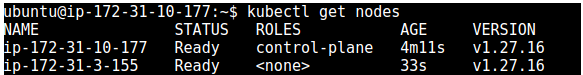

### 4) Modularize Infrastructure with Terraform
- Create Terraform Modules
- 1) VPC
    - modules/vpc/main.tf
    ```
    provider "aws" {
  region = "us-west-2"
    }

    resource "aws_vpc" "main" {
    cidr_block = "10.0.0.0/16"
    enable_dns_support = true
    enable_dns_hostnames = true
    tags = {
        Name = "siddh-vpc"
    }
    }
    resource "aws_internet_gateway" "igw" {
    vpc_id = aws_vpc.main.id
    tags = {
        Name = "siddh-igw"
    }
    }

    resource "aws_subnet" "public" {
    vpc_id                  = aws_vpc.main.id
    cidr_block              = "10.0.1.0/24"
    availability_zone       = "us-west-2a"
    map_public_ip_on_launch = true
    tags = {
        Name = "siddh-public-subnet"
    }
    }

    resource "aws_subnet" "private" {
    vpc_id            = aws_vpc.main.id
    cidr_block        = "10.0.2.0/24"
    availability_zone = "us-west-2b"
    tags = {
        Name = "siddh-private-subnet"
    }
    }

    resource "aws_route_table" "public" {
    vpc_id = aws_vpc.main.id

    route {
        cidr_block = "0.0.0.0/0"
        gateway_id = aws_internet_gateway.igw.id
    }
    tags = {
        Name = "siddh-public-rt"
    }
    }

    resource "aws_route_table_association" "public" {
    subnet_id      = aws_subnet.public.id
    route_table_id = aws_route_table.public.id
    }
    ```
    - modules/vpc/variables.tf
    ```
    variable "vpc_cidr" {
  type        = string
  default     = "10.0.0.0/16"
  description = "CIDR block for the VPC"
    }
    ```
    - modules/vpc/outputs.tf
    ```
    output "vpc_id" {
  value = aws_vpc.main.id
    }

    output "public_subnet_id" {
    value = aws_subnet.public.id
    }

    output "private_subnet_id" {
    value = aws_subnet.private.id
    }

    ```
- 2) Security Groups:
    - modules/security/main.tf
    ```
    resource "aws_security_group" "ec2_sg" {
  vpc_id = var.vpc_id

  ingress {
    from_port   = 22
    to_port     = 22
    protocol    = "tcp"
    cidr_blocks = ["0.0.0.0/0"]
  }

  ingress {
    from_port   = 80
    to_port     = 80
    protocol    = "tcp"
    cidr_blocks = ["0.0.0.0/0"]
  }

  egress {
    from_port   = 0
    to_port     = 0
    protocol    = "-1"
    cidr_blocks = ["0.0.0.0/0"]
  }

  tags = {
    Name = "siddh-ec2_sg"
  }
    }

    resource "aws_security_group" "rds_sg" {
    vpc_id = var.vpc_id

    ingress {
        from_port   = 3306
        to_port     = 3306
        protocol    = "tcp"
        security_groups = [aws_security_group.ec2_sg.id]
    }

    egress {
        from_port   = 0
        to_port     = 0
        protocol    = "-1"
        cidr_blocks = ["0.0.0.0/0"]
    }

    tags = {
        Name = "siddh-rds_sg"
    }
    }
    ```
    - modules/security/variables.tf
    ```
    variable "vpc_id" {
  description = "ID of the VPC"
  type        = string
    }
    ```
    - modules/security/outputs.tf
    ```
    output "ec2_sg_id"{
    value= aws_security_group.ec2_sg.id
    }
    output "rds_sg_id"{
        value= aws_security_group.rds_sg.id
    }
    ```
- 3) EC2 Instances
    - modules/ec2/main.tf
    ```
    resource "aws_instance" "app_server" {  
  ami           = var.ami_id
  instance_type = var.instance_type
  subnet_id     = var.public_subnet_id
  security_groups = [var.web_sg_id]
  tags = {
    Name = "Siddh-Web-Instance"
  }
    }

    resource "aws_eip" "web_eip" {
    instance   = aws_instance.app_server.id
    }
    ```
    - modules/ec2/variables.tf
    ```
    variable "ami_id" {
  description = "AMI ID for the EC2 instances"
  type        = string
    }

    variable "instance_type" {
    description = "Instance type for the EC2 instances"
    type        = string
    default     = "t2.micro"
    }

    variable "public_subnet_id" {
    description = "Public subnet IDs"
    type        = string
    }

    variable "web_sg_id" {
    description = "Security group ID for the web server"
    type        = string
    }
    ```
    - modules/ec2/outputs.tf
    ```
    output "ec2_id"{
    value= aws_instance.app_server.id
    }
    ```
- 4) S3 Bucket
    - modules/s3/main.tf
    ```
    resource "aws_s3_bucket" "app_bucket" {
  bucket = "siddh-bucket"
  tags = {
    Name  = "siddh-bucket"
  }
  
  lifecycle {
    ignore_changes = [tags]
  }
    }
    resource "aws_s3_bucket_versioning" "main" {
    bucket = aws_s3_bucket.app_bucket.id

    versioning_configuration {
        status = "Enabled"
    }
    }
    ```
    - modules/s3/variables.tf
    ```
    variable "bucket_name" {
  description = "The name of the S3 bucket"
  type        = string
    }
    ```
    - modules/s3/outputs.tf
    ```
    output "s3_b_name"{
    value= aws_s3_bucket.app_bucket.id
    }
    ```
- Main Configuration:
    - main.tf
    ```
    terraform {
  required_providers {
    aws = {
      source  = "hashicorp/aws"
      version = "~> 4.16"
    }
  }

  required_version = ">= 1.2.0"
    }

    provider "aws" {
    region = "us-west-2"
    }

    module "vpc" {
    source   = "./modules/vpc"
    vpc_cidr = "10.0.0.0/16"
    }

    module "security" {
    source = "./modules/security"
    vpc_id = module.vpc.vpc_id
    }

    module "ec2" {
    source           = "./modules/ec2"
    ami_id           = "ami-08c40ec9ead489470"
    instance_type    = "t2.micro"
    public_subnet_id = module.vpc.public_subnet_id
    web_sg_id        = module.security.ec2_sg_id
    }

    module "rds" {
    source             = "./modules/rds"
    private_subnet_ids = [module.vpc.public_subnet_id, module.vpc.private_subnet_id]
    db_name            = "mydatabase"
    db_username        = "admin"
    db_password        = "password"
    db_sg_id           = module.security.rds_sg_id
    }

    module "s3" {
    source      = "./modules/s3"
    bucket_name = "my-app-bucket"
    }
    ```
    - variables.tf
    ```
    variable "ami_id" {
    description = "AMI ID for the EC2 instances"
    type        = string
    }

    variable "instance_type" {
    description = "Instance type for the EC2 instances"
    type        = string
    default     = "t2.micro"
    }
    ```
    - outputs.tf
    ```
    output "vpc_id" {
    value = module.vpc.vpc_id
    }

    output "public_subnet_id" {
    value = module.vpc.public_subnet_id
    }

    output "private_subnet_id" {
    value = module.vpc.private_subnet_id
    }

    output "web_ec2_ids" {
    value = module.ec2.ec2_id
    }

    output "db_instance_id" {
    value = module.rds.rds_id
    }

    output "s3_bucket_name" {
    value = module.s3.s3_b_name
    }
    ```
- Initialize and Apply:
```
terraform init
```
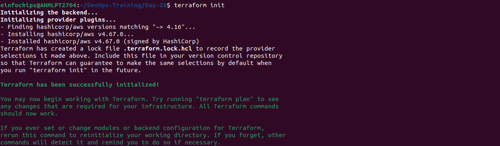
```
terraform plan
```
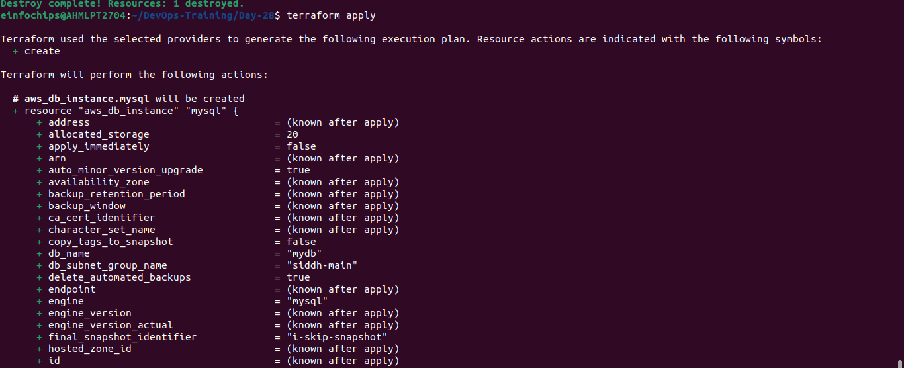
```
terraform apply
```
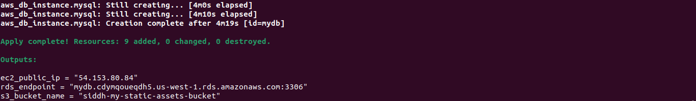

### 5) Containerize Application with Docker
##### - Front-end microservice
 1) Dockerfile:
 ```
 # Use the official Nginx image
FROM nginx:latest

# Copy static HTML files to Nginx's default directory
COPY index.html /usr/share/nginx/html/

# Expose port 80
EXPOSE 80
 ```
 2) index.html:
 ```
 <!DOCTYPE html>
<html lang="en">
<head>
    <meta charset="UTF-8">
    <meta name="viewport" content="width=device-width, initial-scale=1.0">
    <title>Front-End Service</title>
</head>
<body>
    <h1>Welcome to the Front-End Service</h1>
</body>
</html>
 ```
 
 ##### -Product Catalog microservice
 1) Dockerfile:
 ```
 # Use the official Nginx image
FROM nginx:latest

# Copy static HTML files to Nginx's default directory
COPY index.html /usr/share/nginx/html/

# Expose port 80
EXPOSE 80

 ```
 2) index.html:
 ```
 <!DOCTYPE html>
<html lang="en">
<head>
    <meta charset="UTF-8">
    <meta name="viewport" content="width=device-width, initial-scale=1.0">
    <title>Product Catalog Service Service</title>
</head>
<body>
    <h1>Welcome to the Product Catalog Service</h1>
</body>
</html>

 ```
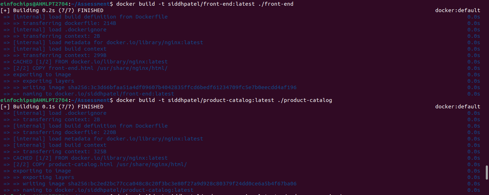
 ##### - Order Processing microservice
 1) Dockerfile:
 ```
 # Use the official Nginx image
FROM nginx:latest

# Copy static HTML files to Nginx's default directory
COPY index.html /usr/share/nginx/html/

# Expose port 80
EXPOSE 80
 ```
 2) index.html:
 ```
 <!DOCTYPE html>
<html lang="en">
<head>
    <meta charset="UTF-8">
    <meta name="viewport" content="width=device-width, initial-scale=1.0">
    <title>Order Processing Service</title>
</head>
<body>
    <h1>Welcome to the Order Processing Service</h1>
</body>
</html>
 ```
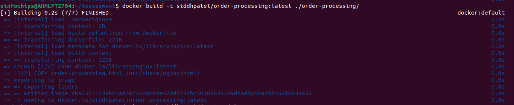
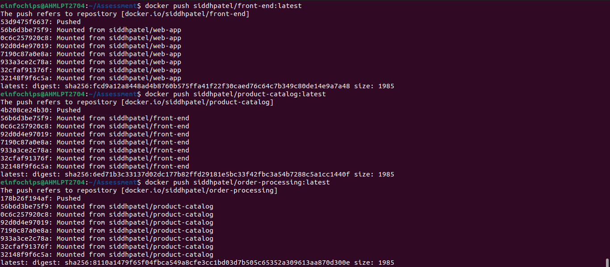


### 6) Configure Ansible for Application Deployment
#### Ansible Playbooks
```
ansible-galaxy init roles/nginx
```

```
ansible-galaxy init roles/nodejs
```

```
ansible-galaxy init roles/mysql
```

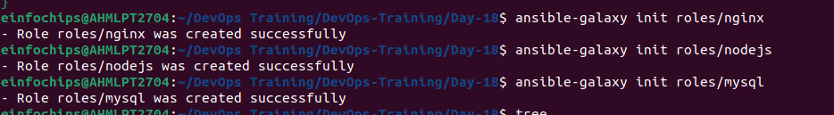

 - roles/nodejs/meta/main.yml
 ```
 dependencies: 
  - role: mysql
    when: ansible_os_family == "Debian"
 ```
  - inventory.ini
  ```
  [frontend]
front ansible_host=54.XX1.74.226 ansible_user=ubuntu ansible_ssh_private_key_file=/home/einfochips/.ssh/ansible-new.pem
[backend]
back ansible_host=54.XX1.74.226 ansible_user=ubuntu ansible_ssh_private_key_file=~/.ssh/ansible-new.pem
[database]
db ansible_host=54.XX1.74.226 ansible_user=ubuntu ansible_ssh_private_key_file=~/.ssh/ansible-new.pem
  ```
 - deploy.yml
  ```
- name: Full Stack Application
  hosts: all
  become: yes
  tasks:
  - name: update_cache
    apt:
      update_cache: yes

- hosts: database
  become: true
  roles:
  - mysql

- hosts: backend
  become: true
  roles:
  - nodejs

- hosts: frontend
  become: true
  roles:
  - nginx

  ```
  - NGINX
    - index.html
  ```
    <!DOCTYPE html>
<html>
<head>
    <title>My Web Application</title>
</head>
<body>
    <center>
        <h1>Welcome to Project 1 Web App</h1>
        <p>This application is deployed using Ansible using Roles.</p>

        
    </center>
</body>
</html>
  ```
  - handlers/main.yml
```
# roles/nginx/handlers/main.yml
---
- name: Restart Nginx
  systemd:
    name: nginx
    state: restarted
```
  - tasks/main.yml
  ```
  ---
- name: Installing Nginx
  apt:
    name: nginx
    state: present
    update_cache: yes

- name: Start Nginx
  systemd:
    name: nginx
    state: started
    enabled: yes

- name: Configure Nginx
  template:
    src: index.html.j2
    dest: /var/www/html/index.html
  notify: Restart Nginx

- name: Nginx is running or not
  service:
    name: nginx
    state: started
    enabled: yes
  ```
  
  - NODEJS
    - tasks/main.yml
```
    - name: Installing Ca-certificates
  apt:
    name: ca-certificates
    state: present
    update_cache: yes

- name: Downloading GPG key
  shell: |
    curl -o /tmp/nodesource.gpg.key https://deb.nodesource.com/gpgkey/nodesource.gpg.key
  args:
    warn: false

- name: Adding GPG key
  apt_key:
    file: "/tmp/nodesource.gpg.key"
    state: present

- name: Installing Node.js LTS repository
  apt_repository:
    repo: "deb https://deb.nodesource.com/node_{{ NODEJS_VERSION }}.x {{ ansible_distribution_release }} main"
    state: present
    update_cache: yes

- name: Install Node.js and npm
  apt:
    name:
    - nodejs
    state: present
```
 - vars/main.yml
 ```
 ---
NODEJS_VERSION: "16"
ansible_distribution_release: "focal"
 ```
 - MYSQL
   - handlers/main.yml
```
---
- name: Restart mysql
  service:
    name: mysql
    state: restarted
``` 
-  tasks/main.yml
```
---
- name: Installing Mysql
  package:
      name: "{{item}}"
      state: present
      update_cache: yes
  loop:
    - mysql-server
    - mysql-client
    - python3-mysqldb
    - libmysqlclient-dev
    
- name: Enabling MySQL service
  service:
      name: mysql
      state: started
      enabled: yes

- name: Setting up user-password
  mysql_user:
    name: root
    password: "{{root_password}}"
    login_unix_socket: /var/run/mysqld/mysqld.sock
    host: localhost
    login_user: root
    login_password: ''
    state: present

- name: Creating admin user (remote access)
  mysql_user:
    name: "{{admin_user}}"
    password: "{{admin_password}}"
    priv: '*.*:ALL'
    host: '%'
    append_privs: yes
    login_user: root
    login_password: "{{root_password}}"
    state: present

- name: Creating Database 
  mysql_db:
    name: "{{db_name}}"
    state: present
    login_user: root
    login_password: "{{root_password}}"

- name: Enabling remote login to mysql
  lineinfile:
    path: /etc/mysql/mysql.conf.d/mysqld.cnf
    regex: '^bind-address\s*=\s*127.0.0.1'
    line: 'bind-address = 0.0.0.0'
    backup: yes
  notify:
    - Restart mysql

- name: Execute MySQL secure installation
  expect:
    command: mysql_secure_installation
    responses:
      'Enter password for user root:': "{{ root_password }}"
      'Press y\|Y for Yes, any other key for No': 'Y'
      'Please enter 0 = LOW, 1 = MEDIUM and 2 = STRONG': "{{ password_validation_policy }}"
      'Change the password for root \? \(\(Press y\|Y for Yes, any other key for No\)': 'n'
      'Remove anonymous users\? \(Press y\|Y for Yes, any other key for No\)': 'Y'
      'Disallow root login remotely\? \(Press y\|Y for Yes, any other key for No\)': 'Y'
      'Remove test database and access to it\? \(Press y\|Y for Yes, any other key for No\)': 'Y'
      'Reload privilege tables now\? \(Press y\|Y for Yes, any other key for No\)': 'Y'
  environment:
    MYSQL_PWD: "{{ root_password }}"
```
- vars/main.yml
```
---
root_password: pass@123
admin_user: Admin
admin_password: Admin@123
db_name: sampledb
password_validation_policy: 1  
```
#### Test Playbooks
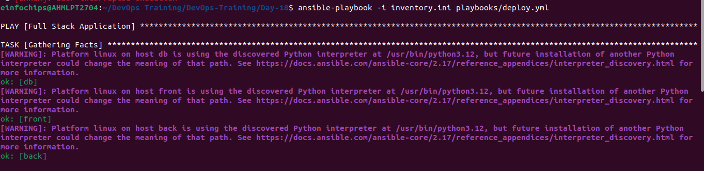
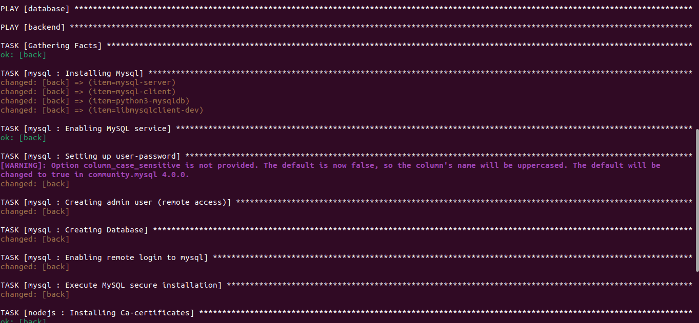
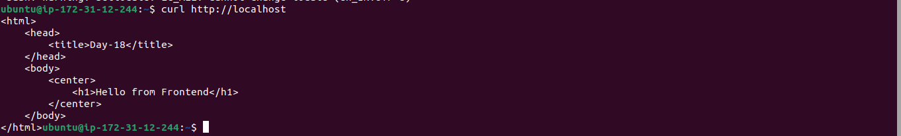

### 7) Set Up Jenkins for CI/CD

**Dockerfile:**
```
# # Use an official OpenJDK runtime as a parent image
FROM openjdk:11-jdk-slim

# # Set the working directory in the container
WORKDIR /app

# # Copy the current directory contents into the container at /app
COPY . /app

# # Compile the Java program
RUN javac Main.java

# # Run the Java program
CMD ["java", "Main"]
# Use the official Nginx base image
#FROM nginx:latest

# Copy the custom HTML file to the appropriate location
#COPY index.html /usr/share/nginx/html/

# Expose port 90
#EXPOSE 90
```
**Jenkins Pipeline Script**: A Jenkinsfile (pipeline script) that:
   1. Clones the GitHub repository.
   1. Builds the Docker image.
   1. Pushes the Docker image to DockerHub.
   1. Deploys a container using the pushed image.

**Jenkinsfile:**
```
pipeline {
    agent any

    environment {
        //DOCKERHUB_CREDENTIALS = credentials('dockerhub-credentials-id')
        REPO_URL = 'https://github.com/siddh2303/day-14-task.git'
        IMAGE_NAME = 'siddhpatel/java-app-build'
    }

    stages {
        stage('Clone Repository') {
            steps {
                git url: "${env.REPO_URL}", branch: 'main'
            }
        }

        stage('Build Docker Image') {
            steps {
                script {
                    dockerImage = docker.build("${env.IMAGE_NAME}")
                    //sh "docker build -t ${env.IMAGE_NAME} ."
                }
            }
        }

        stage('Push Docker Image') {
            steps {
                script {
                    docker.withRegistry('', 'dockerhub-credentials-id') {
                        dockerImage.push()
                        //sh "docker push ${env.IMAGE_NAME}:latest"
                    }
                }
            }
        }

        stage('Deploy Container') {
            steps {
                script {
                    echo "Deploying stage"
                    sh 'javac Main.java'
                    sh 'java Main'
                }
            }
        }
    }

    post {
        always {
            //cleanWs()
            echo 'Finished'
        }
    }
}
```
**DockerHub Repository**: A DockerHub repository where the Docker images will be stored.
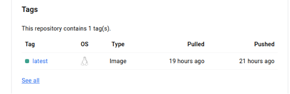

### 8) Deploy the Application Using Helm
#### Setup Helm and Minikube
- Minikube is running or not
```
minikube start
```
- Install Helm
```
curl https://baltocdn.com/helm/signing.asc | gpg --dearmor | sudo tee /usr/share/keyrings/helm.gpg > /dev/null
sudo apt-get install apt-transport-https --yes
echo "deb [arch=$(dpkg --print-architecture) signed-by=/usr/share/keyrings/helm.gpg] https://baltocdn.com/helm/stable/debian/ all main" | sudo tee /etc/apt/sources.list.d/helm-stable-debian.list
sudo apt-get update
sudo apt-get install helm
```

#### AWS Services Setup
- S3 Bucket: Create an S3 bucket for storing application assets (e.g., static files for the frontend).
```
aws s3 mb s3://siddh-helm-bucket --region us-east-2
```
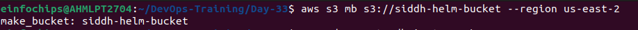
Create Helm Charts
#### - Frontend Chart: Create a Helm chart for a frontend service (e.g., NGINX) that pulls static files from the S3 bucket.

```
helm create frontend
```
- frontend/values.yaml
```
image:
  repository: nginx
  tag: stable
  pullPolicy: IfNotPresent

service:
  type: ClusterIP
  port: 80

s3BucketName: siddh-helm-bucket
```
- frontend/templates/deployment.yaml
```
initContainers:
- name: download-s3-content
  image: amazon/aws-cli
  command: ["/bin/sh", "-c"]
  args: ["aws s3 sync s3://{{ .Values.s3BucketName }} /usr/share/nginx/html"]
  env:
  - name: AWS_ACCESS_KEY_ID
    valueFrom:
      secretKeyRef:
        name: s3-secrets
        key: accessKey
  - name: AWS_SECRET_ACCESS_KEY
    valueFrom:
      secretKeyRef:
        name: s3-secrets
        key: secretKey
```
- frontend/templates/service.yaml
```
apiVersion: v1
kind: Service
metadata:
  name: "frontend-service"
  labels:
    frontend-service
spec:
  type: {{ .Values.service.type }}
  ports:
    - port: {{ .Values.service.port }}
      targetPort: http
      protocol: TCP
      name: http
```
#### - Backend Chart: Create a Helm chart for a backend service (e.g., a Python Flask API) that connects to the RDS MySQL database.
```
helm create backend
```
- backend/values.yaml
```
image:
  repository: "siddhpatel/flask-api"
  tag: "latest"
env:
  dbMaxConnections: "100"
  dbConnectionTimeout: "30s"
secrets:
  db_host: "siddh-mydb.us-east-2.rds.amazonaws.com"
  db_user: "admin"
  db_password: "password"
  db_name: "mydatabase"
```
- backend/templates/deployment.yaml
```
apiVersion: apps/v1
kind: Deployment
metadata:
  name: {{ .Release.Name }}-backend
  labels:
    app: {{ .Release.Name }}-backend
spec:
  replicas: 2
  selector:
    matchLabels:
      app: {{ .Release.Name }}-backend
  template:
    metadata:
      labels:
        app: {{ .Release.Name }}-backend
    spec:
      containers:
      - name: flask-api
        image: {{ .Values.image.repository }}:{{ .Values.image.tag }}
        ports:
        - containerPort: 5000
        env:
        - name: DB_HOST
          valueFrom:
            secretKeyRef:
              name: {{ .Release.Name }}-db-secret
              key: db_host
        - name: DB_USER
          valueFrom:
            secretKeyRef:
              name: {{ .Release.Name }}-db-secret
              key: db_user
        - name: DB_PASSWORD
          valueFrom:
            secretKeyRef:
              name: {{ .Release.Name }}-db-secret
              key: db_password
        - name: DB_NAME
          valueFrom:
            secretKeyRef:
              name: {{ .Release.Name }}-db-secret
              key: db_name
        - name: DB_MAX_CONNECTIONS
          value: "{{ .Values.env.dbMaxConnections }}"   # Quoted
        - name: DB_CONNECTION_TIMEOUT
          value: "{{ .Values.env.dbConnectionTimeout }}" # Quoted
        volumeMounts:
        - name: config-volume
          mountPath: /etc/config
      volumes:
      - name: config-volume
        configMap:
          name: {{ .Release.Name }}-config
```
- backend/templates/service.yaml
```
apiVersion: v1
kind: Service
metadata:
  name: {{ .Release.Name }}-backend
spec:
  type: ClusterIP
  ports:
  - port: 5000
    targetPort: 5000
  selector:
    app: {{ .Release.Name }}-backend
```
- backend/app.py
```
from flask import Flask, jsonify

app = Flask(__name__)

@app.route('/')
def home():
    return jsonify(message="Hello from Flask API!")

if __name__ == '__main__':
    app.run(host='0.0.0.0', port=5000)
```
- backend/Dockerfile
```
# Use the official Python image from the Docker Hub
FROM python:3.9-slim

# Set the working directory in the container
WORKDIR /app

# Copy the requirements file into the container
COPY requirements.txt requirements.txt

# Install the dependencies
RUN pip install -r requirements.txt

# Copy the rest of the application into the container
COPY . .

# Specify the command to run on container start
CMD ["python", "app.py"]

# Expose the port that the app runs on
EXPOSE 5000
```
- backend/requirements.txt
```
Flask==2.1.0
```
#### - Database Chart: Include configurations for connecting to the RDS MySQL instance in the backend chart.
```
helm create database
```
- database/values.yaml
```
database:
  host: siddh-mydb.us-east-2.rds.amazonaws.com
  user: admin
  password: password
  name: mydatabase
```
- database/templates/deployment.yaml
```
apiVersion: apps/v1
kind: Deployment
metadata:
  name: {{ .Release.Name }}-backend
  labels:
    app: {{ .Release.Name }}-backend
spec:
  replicas: 2
  selector:
    matchLabels:
      app: {{ .Release.Name }}-backend
  template:
    metadata:
      labels:
        app: {{ .Release.Name }}-backend
    spec:
      containers:
      - name: flask-api
        image: {{ .Values.image.repository }}:{{ .Values.image.tag }}
        ports:
        - containerPort: 5000
        env:
        - name: DB_HOST
          valueFrom:
            secretKeyRef:
              name: {{ .Release.Name }}-db-secret
              key: db_host
        - name: DB_USER
          valueFrom:
            secretKeyRef:
              name: db-secrets
              key: db_user
        - name: DB_PASSWORD
          valueFrom:
            secretKeyRef:
              name: db-secrets
              key: db_password
        - name: DB_NAME
          valueFrom:
            secretKeyRef:
              name: {{ .Release.Name }}-db-secret
              key: db_name
        - name: S3_ACCESS_KEY
          valueFrom:
            secretKeyRef:
              name: s3-secrets
              key: accessKey
        - name: S3_SECRET_KEY
          valueFrom:
            secretKeyRef:
              name: s3-secrets
              key: secretKey
        - name: DB_MAX_CONNECTIONS
          value: "{{ .Values.env.dbMaxConnections }}"   # Quoted
        - name: DB_CONNECTION_TIMEOUT
          value: "{{ .Values.env.dbConnectionTimeout }}" # Quoted
        volumeMounts:
        - name: config-volume
          mountPath: /etc/config
      volumes:
      - name: config-volume
        configMap:
          name: {{ .Release.Name }}-config
```
- database/templates/service.yaml
```
apiVersion: v1
kind: Service
metadata:
  name: {{ .Release.Name }}-database
  labels:
    app: {{ .Release.Name }}-database
spec:
  selector:
    app: {{ .Release.Name }}-database
  ports:
    - protocol: TCP
      port: 3306  # Default MySQL port
      targetPort: 3306
  type: ClusterIP
```
- database/templates/secrets.yaml
```
apiVersion: v1
kind: Secret
metadata:
  name: {{ .Release.Name }}-db-secret
type: Opaque
data:
  db_host: {{ .Values.database.host | b64enc | quote }}
  db_user: {{ .Values.database.user | b64enc | quote }}
  db_password: {{ .Values.database.password | b64enc | quote }}
  db_name: {{ .Values.database.name | b64enc | quote }}
```
- database/templates/configmap.yaml
```
apiVersion: v1
kind: ConfigMap
metadata:
  name: {{ .Release.Name }}-config
data:
  DB_MAX_CONNECTIONS: "100"
  DB_CONNECTION_TIMEOUT: "30"
```
#### Deploy Multi-Tier Application Using Helm
- Deploy the database chart (connected to the RDS instance).
```
helm install db-release database/
```
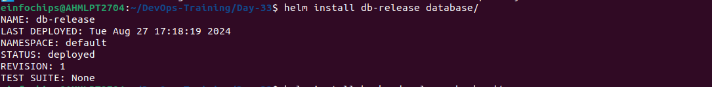
- Deploy the backend chart with dependency on the database chart.
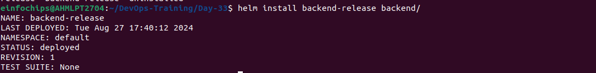
- Deploy the frontend chart with dependency on the backend service, ensuring it pulls assets from the S3 bucket.
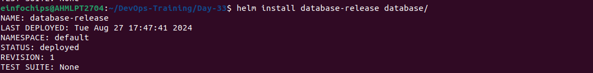

#### Validate Pods
- Validate
```
kubectl get pods
```

```
kubectl get svc
```
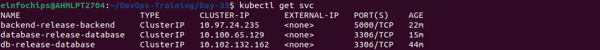

### 9) Clean Up resources
```
terraform destroy
```
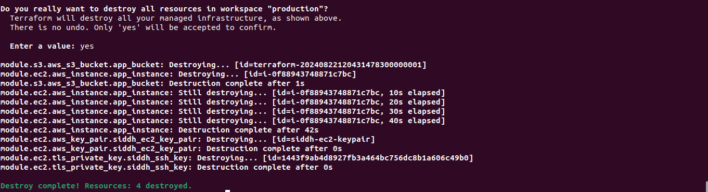

